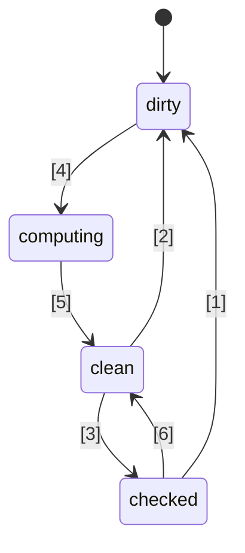
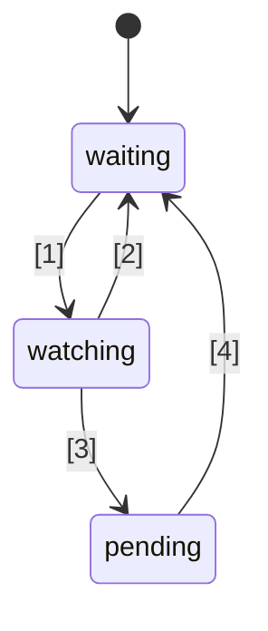

# 🚦 JavaScript Signals 标准提案 🚦


第一阶段（[说明](https://tc39.es/process-document/)）

TC39 提案发起人：Daniel Ehrenberg、Yehuda Katz、Jatin Ramanathan、Shay Lewis、Kristen Hewell Garrett、Dominic Gannaway、Preston Sego、Milo M、Rob Eisenberg

原作者：Rob Eisenberg 和 Daniel Ehrenberg

本文档描述了 JavaScript 中 Signals 的早期通用方向，类似于 Promises/A+ 的努力，后者在 TC39 于 ES2015 标准化 Promises 之前已经存在。你可以通过使用 [polyfill](https://github.com/proposal-signals/signal-polyfill) 亲自试用。

类似于 Promises/A+，本努力专注于使 JavaScript 生态系统保持一致。如果这种一致取得成功，那么基于该经验可能会出现一个标准。多位框架作者正在此协作，共同制定可作为其响应式核心支撑的通用模型。目前的草案基于 [Angular](https://angular.io/)、[Bubble](https://bubble.io/)、[Ember](https://emberjs.com/)、[FAST](https://www.fast.design/)、[MobX](https://mobx.js.org/)、[Preact](https://preactjs.com/)、[Qwik](https://qwik.dev/)、[RxJS](https://rxjs.dev/)、[Solid](https://www.solidjs.com/)、[Starbeam](https://www.starbeamjs.com/)、[Svelte](https://svelte.dev/)、[Vue](https://vuejs.org/)、[Wiz](https://blog.angular.io/angular-and-wiz-are-better-together-91e633d8cd5a) 等作者/维护者的设计输入。

与 Promises/A+ 不同，我们并不试图为开发者提供统一的表层 API，而是专注于底层信号图（signal graph）的精确核心语义。该提案确实包含了完整具体的 API，但该 API 并非面向大多数应用开发者。相反，这里的 signal API 更适合框架在其基础上构建，通过通用信号图和自动追踪机制实现互操作性。

本提案的计划是在推进到第一阶段之后，进行大量早期原型开发，包括集成到多个框架中。我们只会在 Signals 能够在多个框架实际使用且相较于框架自带的信号机制有真正优势的情况下，才考虑将其标准化。我们希望通过大量早期原型开发获得这些信息。详情见下文“状态与开发计划”。

## 背景：为什么需要 Signals？

为开发复杂的用户界面（UI），JavaScript 应用开发者需要高效地存储、计算、失效、同步并推送状态到应用的视图层。UI 通常不仅仅涉及简单值的管理，更多情况下还需要渲染依赖于其他值或状态的复杂计算状态，而这些状态本身也可能是计算得出的。Signals 的目标是为管理这类应用状态提供基础设施，使开发者能专注于业务逻辑，而不是这些重复琐碎的细节。

类似信号的结构在非 UI 场景中也被证明非常有用，特别是在构建系统中用于避免不必要的重构。

Signals 在响应式编程中用来消除在应用程序中手动管理更新的需求。

> 一种基于状态变化进行更新的声明式编程模型。

摘自 _[What is Reactivity?](https://www.pzuraq.com/blog/what-is-reactivity)_。

#### 示例 - 原生 JS 计数器

假设有一个变量 `counter`，你希望渲染到 DOM 中显示该计数器是偶数还是奇数。每当 `counter` 发生变化时，你都想用最新的奇偶性更新 DOM。在原生 JS 中，你可能会这样写：

```js
let counter = 0;
const setCounter = (value) => {
  counter = value;
  render();
};

const isEven = () => (counter & 1) == 0;
const parity = () => isEven() ? "even" : "odd";
const render = () => element.innerText = parity();

// 模拟 counter 的外部更新...
setInterval(() => setCounter(counter + 1), 1000);
```
> [!NOTE]  
> 这里为演示目的使用了全局变量。正确的状态管理有很多方案，本提案中的示例尽量保持最小化。该提案并不鼓励使用全局变量。

这有很多问题……

* `counter` 的设置很冗长且模板化严重。
* `counter` 状态与渲染系统紧密耦合。
* 如果 `counter` 变化但 `parity` 不变（如从 2 变为 4），则我们会不必要地计算奇偶性并重复渲染。
* 如果 UI 的另一个部分只关心 `counter` 更新怎么办？
* 如果 UI 的另一个部分只依赖于 `isEven` 或 `parity` 怎么办？

即使在这个相对简单的场景下，也会很快出现许多问题。我们可以尝试通过为 `counter` 引入发布/订阅（pub/sub）机制来规避这些问题，这样 `counter` 的其他消费者就可以订阅并添加自己的状态变更反应。

然而，我们仍然会遇到以下问题：

* 渲染函数实际上只依赖于 `parity`，但却必须“知道”需要订阅 `counter`。
* 不能仅根据 `isEven` 或 `parity` 更新 UI，而必须直接与 `counter` 交互。
* 模板代码增多。每次使用变量时，不仅仅是调用函数或读取变量，还要订阅并在那处理更新。取消订阅的管理也尤其复杂。

现在，我们可以通过不仅为 `counter`，还为 `isEven` 和 `parity` 添加发布/订阅机制来解决部分问题。这样就需要将 `isEven` 订阅到 `counter`，`parity` 订阅到 `isEven`，`render` 订阅到 `parity`。不幸的是，我们的模板代码激增，还要管理大量的订阅关系。如果没有正确清理，极易造成内存泄漏灾难。因此，虽然解决了一些问题，却又带来了全新的问题类别和大量代码。更糟糕的是，这一过程要对系统中的每个状态都重复一遍。

### 引入 Signals

在 UI 中，模型与视图间的数据绑定抽象长期以来都是多种编程语言 UI 框架的核心，尽管 JS 或 Web 平台本身没有内建这种机制。在 JS 框架和库中，围绕如何表示这种绑定有大量的探索实践，经验表明，结合一等数据类型（代表状态单元或由其他数据派生的计算单元）的一元数据流动非常强大，这类类型现今通常被称为“Signals”。
这种一等响应式值的方式，似乎最早在开源 JavaScript Web 框架中由 [Knockout](https://knockoutjs.com/) [于 2010 年](https://blog.stevensanderson.com/2010/07/05/introducing-knockout-a-ui-library-for-javascript/) 引入。此后几年，出现了许多变种与实现。在过去的三到四年里，Signal 原语及相关方法进一步流行，几乎所有现代 JavaScript 库或框架都拥有类似机制（名称各异）。

为理解 Signals，让我们用下面即将详述的 Signal API，重新构想上面的例子。

#### 示例 - Signals 计数器

```js
const counter = new Signal.State(0);
const isEven = new Signal.Computed(() => (counter.get() & 1) == 0);
const parity = new Signal.Computed(() => isEven.get() ? "even" : "odd");

// 库或框架基于其他 Signal 原语定义副作用
declare function effect(cb: () => void): (() => void);

effect(() => element.innerText = parity.get());

// 模拟 counter 的外部更新...
setInterval(() => counter.set(counter.get() + 1), 1000);
```

我们可以立刻看到几点优势：
* 我们消除了前例中 `counter` 变量周围的冗余模板代码。
* 有一个统一的 API 处理值、计算和副作用。
* 不存在 `counter` 与 `render` 间的循环引用或颠倒依赖关系问题。
* 无需手动订阅，也无需记录管理。
* 可以控制副作用的时机/调度。

不过，Signals 带来的优势远不止 API 表面看到的这些：
* **自动依赖跟踪** - 计算型 Signal 会自动发现它所依赖的其他 Signal，无论这些 Signal 是简单值还是其他计算结果。
* **惰性求值** - 计算在声明时不会被急切地执行，依赖项发生变化时也不会立即计算。只有在明确请求其值时才会进行计算。
* **记忆化** - 计算型 Signal 会缓存其上一次的值，因此在依赖项没有变化的情况下，无论访问多少次，都无需重新计算。

## 将 Signals 标准化的动机

#### 互操作性

每个 Signal 实现都有自己的自动跟踪机制，用于在计算型 Signal 评估时记录所遇到的来源。这导致在不同框架之间共享模型、组件和库变得困难——它们往往与其视图引擎产生了虚假耦合（因为 Signal 通常作为 JS 框架的一部分实现）。

本提案的目标之一是彻底解耦响应式模型与渲染视图，使开发者能够在不重写非 UI 代码的情况下迁移到新的渲染技术，或者在 JS 中开发可在不同环境下部署的共享响应式模型。不幸的是，由于版本和重复问题，通过 JS 层级的库实现强共享是不切实际的——内置功能提供了更强的共享保证。

#### 性能/内存使用

由于常用库变为内置，减少代码体积总是有一定的性能提升潜力，但 Signal 的实现通常非常小，因此我们预计这种效果不会很大。

我们推测，Signal 相关数据结构和算法的原生 C++ 实现，相比于 JS 能实现的，可能会更高效一些，但只是常数级的提升。然而，预计不会有与 polyfill 存在差异的算法性变更；引擎在这里不会有“魔法”，响应式算法本身也将被明确定义。

冠军小组（Champion group）计划开发多种 Signal 实现，并利用这些实现来研究性能的可能性。

#### 开发者工具（DevTools）

对于现有的 JS 语言 Signal 库，追踪如下内容可能会比较困难：
* 跨多个计算型 Signal 的调用栈，显示错误的因果链
* Signal 之间的引用图（Reference Graph），即一个 Signal 依赖于另一个 Signal——这在调试内存使用时很重要

内置 Signal 使得 JS 运行时和开发者工具有可能更好地支持对 Signal 的检查，尤其是在调试或性能分析时，无论是集成在浏览器中还是通过共享扩展实现。现有工具如元素检查器、性能快照和内存分析器，都可以针对 Signal 信息进行特别展示。

#### 次要收益

##### 标准库的好处

总体而言，JavaScript 的标准库一直比较精简，但 TC39 的趋势是让 JS 成为一个“自带电池”的语言，具备高质量的内建功能。例如，Temporal 正在替代 moment.js，许多小特性（如 `Array.prototype.flat` 和 `Object.groupBy`）正在替代 lodash 的许多用例。其好处包括更小的包体积、更高的稳定性和质量、加入新项目时的学习成本更低，以及 JS 开发者之间普遍的通用术语。

##### HTML/DOM 集成（未来的可能性）

W3C 和浏览器实现者正在努力为 HTML 引入原生模板功能（[DOM Parts][wicg-pr-1023] 和 [Template Instantiation][wicg-propsal-template-instantiation]）。此外，W3C Web Components 社区组正在探索扩展 Web Components 以提供完全声明式 HTML API 的可能性。要实现这些目标，最终 HTML 需要一种响应式原语。此外，社区已经设想并提出了许多通过集成 Signal 改善 DOM 易用性的需求。

[wicg-pr-1023]: https://github.com/WICG/webcomponents/pull/1023
[wicg-propsal-template-instantiation]: https://github.com/WICG/webcomponents/blob/gh-pages/proposals/Template-Instantiation.md

> 注意，这类集成将是后续的独立工作，并非本提案的一部分。

##### 生态系统信息交流（*不是* 推出标准的理由）

标准化工作有时即使在浏览器未变的情况下，也能在“社区”层面带来帮助。Signals 的推进汇集了许多不同框架的作者，共同深入讨论响应式的本质、算法和互操作性。这已被证明很有价值，但这本身不足以让其被 JS 引擎和浏览器采纳；只有当 Signal 标准化带来的好处*超越*生态信息交流时，才应纳入 JavaScript 标准。

## Signal 的设计目标

事实证明，现有的 Signal 库在核心上并没有太大区别。本提案旨在借鉴这些库的成功经验，实现它们许多重要特性。

### 核心特性

* 一种表示状态的 Signal 类型，即可写 Signal。这是一个可被他人读取的值。
* 一种计算型/记忆型/派生 Signal 类型，依赖于其他 Signal，并以惰性方式计算和缓存。
    * 计算是惰性的，即当某个依赖项变化时，默认不会立即重新计算计算型 Signal，只有当有人真正读取时才会执行。
    * 计算“[无故障](https://en.wikipedia.org/wiki/Reactive_programming#Glitches)”，即不会执行任何不必要的计算。这意味着，当应用读取计算型 Signal 时，会对可能变脏的图进行拓扑排序以消除重复计算。
    * 计算是有缓存的，即在依赖项变化后，若没有依赖项再发生变化，则访问时不会重新计算计算型 Signal。
    * 计算型 Signal 和状态 Signal 都支持自定义比较器，用于判断依赖它们的进一步计算型 Signal 是否需要更新。
* 针对计算型 Signal 某个依赖（或嵌套依赖）变“脏”并发生变化的情况做出反应，表明该 Signal 的值可能已经过时。
    * 这种反应用于调度后续更重要的工作。
    * 副作用（Effects）是通过这些反应以及框架级调度来实现的。
    * 计算型 Signal 需要能感知自己是否被注册为这些反应的（嵌套）依赖。
* 允许 JS 框架自行调度。不强制使用 Promise 风格的内建调度。
    * 需要同步反应以便根据框架逻辑调度后续工作。
    * 写入操作是同步的并立即生效（如框架希望批量写入，可在其上实现）。
    * 可以将判断 Effect 是否“脏”与实际运行 Effect 分离（支持两阶段 Effect 调度器）。
* 能够在不记录依赖的情况下读取 Signal（`untrack`）
* 支持使用 Signal/响应式机制进行不同代码库的组合，例如：
    * 就跟踪/响应式本身而言，可以同时使用多个框架（但具体细节见下文）
    * 跨框架的响应式数据结构（如递归响应式 store 代理、响应式 Map、Set、Array 等）

### 健全性

* 阻止/禁止同步反应的简单误用。
    * 健全性风险：如果使用不当，可能暴露“[故障](https://en.wikipedia.org/wiki/Reactive_programming#Glitches)”：如果在 Signal 设置时立即渲染，可能会向最终用户暴露不完整的应用状态。因此，此功能应只用于在应用逻辑完成后智能地调度后续工作。
    * 方案：禁止在同步反应回调中读取或写入任何 Signal
* 不鼓励使用 `untrack`，并标记其不安全性质
    * 健全性风险：允许创建值依赖于其他 Signal、但这些 Signal 变化时不会被更新的计算型 Signal。只有在非跟踪访问不会改变计算结果时才应使用。
    * 方案：API 在命名上标记为“不安全”。
* 注意：本提案允许信号既可以从计算型和副作用型信号中读取和写入，也不限制先读后写，尽管存在健全性风险。这样做是为了保持与各种框架集成的灵活性和兼容性。

### 表面 API

* 必须为多个框架实现其 Signal/响应式机制提供坚实基础。
    * 应为递归 store 代理、基于装饰器的类字段响应式，以及 `.value` 和 `[state, setState]` 风格 API 提供良好基础。
    * 语义能够表达不同框架支持的有效模式。例如，Signal 应能作为立即反映写入或稍后批量应用写入的基础。
* 如果该 API 能被 JavaScript 开发者直接使用会更好。
    * 如果某个特性与生态系统概念一致，采用通用术语更好。
        * 但重要的是不要完全照搬现有名称！
    * 在“JS 开发者易用性”与“为框架提供全部钩子”之间权衡
        * 思路：提供全部钩子，但如有误用则抛出错误。
        * 思路：将细致 API 放在 `subtle` 命名空间下，类似于 [`crypto.subtle`](https://developer.mozilla.org/en-US/docs/Web/API/Crypto/subtle)，以区分高级用法（如实现框架或开发者工具）与日常应用开发（如为框架实例化 Signal）。
* 可实现且能以良好性能使用——表面 API 不会引入过多开销
    * 支持子类化，让框架能添加自己的方法和字段，包括私有字段。这对于避免框架层额外分配很重要。见下文“内存管理”。

### 内存管理

* 如果可能：若没有任何活动引用可能会读取某个计算型 Signal，则该计算型 Signal 应可被垃圾回收，即使它仍在更大的图中（如依赖于一个仍然存活的状态值）。
* 请注意，目前大多数框架在计算型 Signal 与其他仍然存活的 Signal 图存在任何引用时，都需要显式释放这些计算型 Signal。
* 当它们的生命周期与 UI 组件的生命周期绑定，并且副作用本身也需要被释放时，这种情况其实并不糟糕。
* 如果以这种语义执行的代价太高，那么我们应该在下方的 API 中添加对计算型 Signal 的显式释放（或“解除链接”）操作，目前该 API 尚未包含此功能。
* 一个相关但独立的目标：最小化分配次数，例如：
    * 创建可写 Signal（避免两个独立的闭包 + 数组）
    * 实现副作用（避免为每个反应创建闭包）
    * 在用于观察 Signal 变化的 API 中，避免创建额外的临时数据结构
    * 解决方案：基于类的 API，允许子类重用已定义的方法和字段

## API 草图

下面是 Signal API 的初步设想。请注意，这只是一个早期草案，我们预计未来会有变化。我们先从完整的 `.d.ts` 入手，了解整体结构，然后再讨论各部分的详细含义。

```ts
interface Signal<T> {
    // 获取信号的值
    get(): T;
}

namespace Signal {
    // 可读写的 Signal
    class State<T> implements Signal<T> {
        // 创建一个以 t 作为初始值的 state Signal
        constructor(t: T, options?: SignalOptions<T>);

        // 获取信号的值
        get(): T;

        // 设置 state Signal 的值为 t
        set(t: T): void;
    }

    // 基于其他 Signal 的公式型 Signal
    class Computed<T = unknown> implements Signal<T> {
        // 创建一个 Signal，其值由回调函数返回。
        // 回调函数以该 signal 作为 this 上下文调用。
        constructor(cb: (this: Computed<T>) => T, options?: SignalOptions<T>);

        // 获取信号的值
        get(): T;
    }

    // 此命名空间包含更“高级”的功能，建议框架作者使用，
    // 而非应用开发者。类似于 `crypto.subtle`
    namespace subtle {
        // 以禁用所有追踪的方式运行回调
        function untrack<T>(cb: () => T): T;

        // 获取当前正在追踪任何 signal 读取的计算型 signal（如果有的话）
        function currentComputed(): Computed | null;

        // 返回上次评估时，该信号引用的所有信号的有序列表。
        // 对于 Watcher，列出它正在监听的 signal 集合。
        function introspectSources(s: Computed | Watcher): (State | Computed)[];

        // 返回包含该信号的 Watchers，以及上次评估时读取该信号的
        // Computed 信号（如果该 computed 信号（递归地）被监听）。
        function introspectSinks(s: State | Computed): (Computed | Watcher)[];

        // 如果该信号是“存活”的，即被 Watcher 监听，
        // 或被（递归地）存活的 Computed 信号读取，则返回 true。
        function hasSinks(s: State | Computed): boolean;

        // 如果该元素是“响应式”的，即它依赖于其他 signal，则返回 true。
        // 如果 Computed 的 hasSources 为 false，则其总是返回同一个常量。
        function hasSources(s: Computed | Watcher): boolean;

        class Watcher {
            // 当 Watcher 的（递归）源被写入时，调用该回调，
            // 如果自上次 `watch` 调用以来还未调用过。
            // 在 notify 期间，不允许读取或写入任何 signal。
            constructor(notify: (this: Watcher) => void);

            // 将这些 signal 添加到 Watcher 的集合中，并设置 watcher，
            // 使其在集合中的任一 signal（或其依赖项）发生变化时，下次运行 notify 回调。
            // 可不带参数调用，仅用于重置“已通知”状态，以便再次调用 notify 回调。
            watch(...s: Signal[]): void;

            // 从监听集合中移除这些 signal（例如，用于已释放的副作用）
            unwatch(...s: Signal[]): void;

            // 返回 Watcher 集合中仍为 dirty 的源 signal 集合，
            // 或者是具有 dirty 或 pending 源、尚未重新评估的 Computed signal
            getPending(): Signal[];
        }

        // 观察 signal 被监听或不再被监听的钩子
        var watched: Symbol;
        var unwatched: Symbol;
    }

    interface SignalOptions<T> {
        // 自定义旧值与新值的比较函数。默认：Object.is。
        // signal 作为 this 上下文传入。
        equals?: (this: Signal<T>, t: T, t2: T) => boolean;
```
```ts
    // 当 isWatched 从 false 变为 true 时调用的回调
    [Signal.subtle.watched]?: (this: Signal<T>) => void;

    // 当 isWatched 从 true 变为 false 时调用的回调
    [Signal.subtle.unwatched]?: (this: Signal<T>) => void;
}
```

### 信号（Signals）如何工作

Signal 表示一个可能随时间变化的数据单元。Signal 可以是“状态”（仅手动设置的值）或“计算值”（基于其他 Signal 的公式）。

计算型 Signal 通过自动跟踪在其计算过程中被读取的其他 Signal 来工作。当读取计算型 Signal 时，它会检查其先前记录的依赖项是否有变化，如果有，则会重新计算自身。当多个计算型 Signal 嵌套时，所有的跟踪归属于最内层的那个。

计算型 Signal 是惰性的，即基于拉取：只有在被访问时才会重新计算，即使其某个依赖项之前已发生变化。

传递给计算型 Signal 的回调通常应该是“纯函数”，即对其访问的其他 Signal 的确定性、无副作用的函数。同时，回调被调用的时机是确定性的，因此可以谨慎地使用副作用。

Signal 具有显著的缓存/记忆化特性：状态和计算型 Signal 都会记住其当前值，只有当它们实际变化时，才会触发引用它们的计算型 Signal 的重新计算。甚至不需要反复比较旧值和新值 —— 当源 Signal 被重置/重新计算时只比较一次，并且 Signal 机制会跟踪哪些引用了该 Signal 的内容还未基于新值更新。在内部，这通常通过“图着色”（graph coloring）实现，如（Milo 的博客文章）所述。

计算型 Signal 动态跟踪其依赖 —— 每次运行时，它们最终可能依赖于不同的内容，并且精确的依赖集会在 Signal 图中保持最新。这意味着，如果某个依赖只在一个分支中需要，而上一次计算走了另一个分支，那么对该临时未使用值的更改不会导致计算型 Signal 被重新计算，即使被拉取。

与 JavaScript 的 Promise 不同，Signal 中的一切都是同步运行的：
- 将 Signal 设置为新值是同步的，并且这会立即反映在之后读取的任何依赖于它的计算型 Signal 上。此变更没有内置的批处理机制。
- 读取计算型 Signal 是同步的 —— 它们的值始终可用。
- 如下所述，Watcher 的 `notify` 回调在触发它的 `.set()` 调用期间同步运行（但在图着色完成之后）。

与 Promise 类似，Signal 可以表示错误状态：如果计算型 Signal 的回调抛出异常，则该错误会像其他值一样被缓存，并在每次读取 Signal 时重新抛出。

### 理解 Signal 类

一个 `Signal` 实例表示读取一个动态变化值的能力，其更新会随时间被跟踪。它还隐式包含了通过另一个计算型 Signal 的跟踪访问来订阅该 Signal 的能力。

这里的 API 设计旨在与大量 Signal 库在使用“signal”、“computed”和“state”等名称上的生态粗略共识保持一致。然而，对计算型和状态型 Signal 的访问是通过 `.get()` 方法，这与所有流行的 Signal API 不同，后者要么使用 `.value` 风格的访问器，要么使用 `signal()` 调用语法。

该 API 设计目的是减少分配次数，使 Signal 适合嵌入到 JavaScript 框架中，并达到与现有框架定制 Signal 相同或更好的性能。这意味着：
- 状态型 Signal 是一个可写对象，可以通过同一个引用进行读取和设置。（见下文“能力分离”部分的影响。）
- 状态型和计算型 Signal 都设计为可被子类化，方便框架通过公共或私有类字段（以及用于操作该状态的方法）添加额外属性。
- 各种回调（如 `equals`、计算型回调）会以相关 Signal 作为 `this` 上下文调用，因此每个 Signal 不需要新建闭包。相反，可以将上下文保存在 Signal 本身的额外属性中。

本 API 强制执行的一些错误条件：
- 递归读取计算型 Signal 是错误的。
- Watcher 的 `notify` 回调不能读取或写入任何 Signal。
- 如果计算型 Signal 的回调抛出异常，则对 Signal 的后续访问会重新抛出该缓存错误，直到某个依赖项发生变化并重新计算为止。

一些*未*强制执行的条件：
- 计算型 Signal 可以在其回调内部同步写入其他 Signal。
- 由 Watcher 的 `notify` 回调排队的任务可以读取或写入 Signal，这使得可以用 Signal 复现[经典 React 反模式](https://react.dev/learn/you-might-not-need-an-effect)。

### 实现副作用（effects）

上面定义的 `Watcher` 接口为实现典型的 JS 副作用 API 提供了基础：当其他 Signal 发生变化时，重新运行回调，仅用于其副作用。初始示例中使用的 `effect` 函数可以如下定义：

```ts
// 这个函数通常会存在于库/框架中，而不是应用代码中
// 注意：本调度逻辑过于基础，不建议直接复制粘贴。
let pending = false;

let w = new Signal.subtle.Watcher(() => {
    if (!pending) {
        pending = true;
        queueMicrotask(() => {
            pending = false;
            for (let s of w.getPending()) s.get();
            w.watch();
        });
    }
});

// 一个 effect Signal，每当其依赖项可能发生变化时，
// 会在微任务队列中安排对自身的读取
export function effect(cb) {
    let destructor;
    let c = new Signal.Computed(() => { destructor?.(); destructor = cb(); });
    w.watch(c);
    c.get();
    return () => { destructor?.(); w.unwatch(c) };
}
```

Signal API 不包括类似 `effect` 的内置函数。这是因为副作用的调度比较微妙，通常与框架的渲染周期及其他高级框架特有的状态或策略有关，而 JS 无法访问这些内容。

下面解释这里用到的各种操作：传递给 `Watcher` 构造函数的 `notify` 回调是在 Signal 从“干净”状态（缓存已初始化且有效）变为“已检查”或“脏”状态（由于递归依赖的某个状态被更改，缓存可能有效也可能无效）时被调用的函数。

`notify` 的调用最终由某个状态型 Signal 上的 `.set()` 调用触发。该调用是同步的：在 `.set` 返回之前发生。但无需担心此回调会观察到半处理状态下的 Signal 图，因为在 `notify` 回调期间，任何 Signal 都不能被读取或写入，即使在 `untrack` 调用中也不行。由于 `notify` 在 `.set()` 期间被调用，它会中断另一条尚未完成的逻辑线程。要在 `notify` 中读取或写入 Signal，请安排稍后运行的任务，例如将 Signal 写入一个列表以便稍后访问，或如上例所示使用 `queueMicrotask`。

请注意，完全可以不使用 `Signal.subtle.Watcher`，而通过调度对计算型 Signal 的轮询（如 Glimmer 所做）来高效使用 Signal。不过，许多框架发现让此调度逻辑同步运行通常非常有用，因此 Signal API 包含了它。

计算型和状态型 Signal 都像任何 JS 值一样被垃圾回收。但 Watcher 有一种特殊的持有方式：任何被 Watcher 监听的 Signal 只要其底层状态仍可达，就会被保持存活，因为这些状态可能会触发未来的 `notify` 调用（进而触发未来的 `.get()`）。因此，请记得调用 `Watcher.prototype.unwatch` 来清理副作用。

### 一个不安全的逃生口

`Signal.subtle.untrack` 是一个允许*不*跟踪读取 Signal 的逃生口。该能力不安全，因为它允许创建依赖于其他 Signal 却不会在这些 Signal 发生变化时更新的计算型 Signal。只有在未跟踪访问不会改变计算结果时才应使用。

<!--
TODO: 展示何时应该使用 untrack 的示例

### 使用 watched/unwatched
TODO：展示将 Observable 转换为计算信号的示例，仅在被 effect 使用时订阅

TODO：展示一个计算信号的示例，该信号表示针对某个状态发起的 fetch 结果，并且该 fetch 可以被取消

### SSR 的自省能力

TODO：展示信号图序列化的工作方式

TODO：展示如何使用少量信号将信号从 state “注水”到 computed

-->

### 当前省略的内容

这些功能可能会在之后添加，但当前草案中未包含。它们被省略的原因在于各框架在设计空间上尚未达成一致共识，以及目前已经有办法通过本文档中描述的 Signals 概念之上的机制来规避这些缺失。然而，不幸的是，这些省略限制了框架间互操作性的潜力。随着本文档中描述的 Signals 原型的产生，将会努力重新审视这些省略是否为适当的决定。

* **异步（Async）**：在本模型中，Signal 总是可以同步求值。然而，经常有某些异步过程导致信号被设置，并且需要了解信号当前是否还处于“加载中”。用异常来建模加载状态是一种简单方式，且计算信号的异常缓存行为与这一技术有一定的组合能力。改进的技术在 [Issue #30](https://github.com/proposal-signals/proposal-signals/issues/30) 中有讨论。
* **事务（Transactions）**：在视图切换时，通常需要同时维护“from”和“to”状态的实时状态。“to”状态在后台渲染，直到可以切换（提交事务），而“from”状态依然可交互。要同时维护两个状态，需要对信号图的状态进行“分叉”，甚至可能需要同时支持多个待处理的切换。详见 [Issue #73](https://github.com/proposal-signals/proposal-signals/issues/73)。

一些可能的[便捷方法](https://github.com/proposal-signals/proposal-signals/issues/32)也被省略。

## 状态与开发计划

本提案已列入 2024 年 4 月 TC39 Stage 1 议程。目前可以将其视为“Stage 0”。

[本提案的 polyfill](https://github.com/proposal-signals/signal-polyfill) 已经可用，并带有一些基础测试。一些框架作者已经开始尝试用该信号实现进行替换，但仍处于早期阶段。

Signal 提案的协作者们在推动本提案进展时希望特别**保守**，以避免最终发布了我们后悔且实际上并未广泛使用的功能。我们的计划是完成以下 TC39 流程未要求的额外任务，以确保提案方向正确：

在提出 Stage 2 之前，我们计划：
- 开发多个面向生产的 polyfill 实现，这些实现要健壮、经过良好测试（例如能通过各种框架的测试以及 test262 风格的测试），并在性能上具有竞争力（通过全面的信号/框架基准测试集验证）。
- 将提议的 Signal API 集成到我们认为具有代表性的众多 JS 框架中，并有一些大型应用基于此工作。在这些场景下测试其高效性与正确性。
- 对 API 可能的扩展空间有充分理解，并明确哪些（如果有的话）应被加入本提案。

## Signal 算法

本节以算法的形式描述了暴露给 JavaScript 的每个 API。可以将其视为初步规范，在这一早期阶段用于确定一组可能的语义，同时对更改持开放态度。

算法的一些方面：
- 在计算信号中读取 Signal 的顺序是重要的，这在某些回调（如 `Watcher` 被调用、`equals`、`new Signal.Computed` 的第一个参数、`watched`/`unwatched` 回调）的执行顺序中是可观察的。这意味着计算信号的源必须有序存储。
- 这四个回调都可能抛出异常，这些异常会以可预测的方式传递给调用的 JS 代码。这些异常*不会*中断算法执行，也不会让信号图处于半处理状态。对于 Watcher 的 `notify` 回调中抛出的错误，该异常会传递到触发它的 `.set()` 调用，如果有多个异常，则使用 AggregateError 打包。其他异常（包括 `watched`/`unwatched`？）会存储在 Signal 的值中，在读取时重新抛出，并且这样的重新抛出信号可以像普通值一样被标记为 `~clean~`。
- 针对未被“观察”（未被任何 Watcher 观察）的计算信号，为避免循环引用，采取了措施使其能独立于信号图的其它部分被垃圾回收。在内部可以通过始终可收集的代数（generation numbers）系统实现；需要注意的是，优化实现可能还会包括每节点本地的代数，或对已被观察的信号避免跟踪某些数字。

### 隐含的全局状态

Signal 算法需要引用某些全局状态。这些状态在整个线程或“代理（agent）”中全局唯一。

- `computing`：当前由于 `.get` 或 `.run` 调用而正在重新计算的最内层计算或 effect Signal，或为 `null`。初始为 `null`。
- `frozen`：布尔值，表示当前是否有回调在执行且要求信号图不可被修改。初始为 `false`。
- `generation`：递增整数，从 0 开始，用于在避免循环时追踪值的时效性。

### `Signal` 命名空间

`Signal` 是一个普通对象，用作 Signal 相关类和函数的命名空间。

`Signal.subtle` 是类似的内部命名空间对象。

### `Signal.State` 类

#### `Signal.State` 内部槽

- `value`：状态信号的当前值
- `equals`：更改值时使用的比较函数
- `watched`：当信号被 effect 观察时调用的回调
- `unwatched`：当信号不再被 effect 观察时调用的回调
- `sinks`：依赖于此信号的已被观察信号集合

#### 构造函数：`Signal.State(initialValue, options)`

1. 将此 Signal 的 `value` 设为 `initialValue`。
1. 将此 Signal 的 `equals` 设为 options?.equals
1. 将此 Signal 的 `watched` 设为 options?.[Signal.subtle.watched]
1. 将此 Signal 的 `unwatched` 设为 options?.[Signal.subtle.unwatched]
1. 将此 Signal 的 `sinks` 设为空集合

#### 方法：`Signal.State.prototype.get()`

1. 如果 `frozen` 为 true，抛出异常。
1. 如果 `computing` 不为 `undefined`，将此 Signal 加入 `computing` 的 `sources` 集合。
1. 注：仅当此信号被 Watcher 观察时，才会将 `computing` 加入此信号的 `sinks` 集合。
1. 返回此 Signal 的 `value`。

#### 方法：`Signal.State.prototype.set(newValue)`

1. 如果当前执行上下文为 `frozen`，抛出异常。
1. 使用此 Signal 和第一个参数的值运行“设置 Signal 值”算法。
1. 如果该算法返回 `~clean~`，则返回 undefined。
1. 将此 Signal 所有 `sinks` 的 `state` 设置为（如果是 Computed Signal）`~dirty~`（若之前为 clean），或（如果是 Watcher）`~pending~`（若之前为 `~watching~`）。
1. 递归地将所有 sinks 的 Computed Signal 依赖的 `state` 设置为 `~checked~`（若之前为 `~clean~`，即保留 dirty 标记），或对于 Watcher，若之前为 `~watching~` 则设为 `~pending~`。
1. 对于在递归过程中遇到的每个先前为 `~watching~` 的 Watcher，按照深度优先顺序：
    1. 设 `frozen` 为 true。
    1. 调用其 `notify` 回调（保存抛出的异常，但忽略 `notify` 的返回值）。
    1. 恢复 `frozen` 为 false。
    1. 将 Watcher 的 `state` 设为 `~waiting~`。
1. 如果有任何 `notify` 回调抛出异常，在所有 `notify` 回调执行完后将异常传递给调用者。如有多个异常，则使用 AggregateError 打包后抛出。
1. 返回 undefined。

### `Signal.Computed` 类

#### `Signal.Computed` 状态机
`Computed Signal` 的 `state` 可能为以下之一：

- `~clean~`：该 Signal 的值已存在，并且已知不是过时的。
- `~checked~`：该 Signal 的（间接）源已发生变化；该 Signal 有一个值，但它 _可能_ 是过时的。是否过时只有在所有直接源都被评估后才会知道。
- `~computing~`：由于 `.get()` 调用的副作用，当前正在执行该 Signal 的回调。
- `~dirty~`：该 Signal 的值已知为过时，或从未被评估过。

状态转换图如下：



转换如下：
| 编号 | 从 | 到 | 条件 | 算法 |
| ---- | -- | -- | ---- | ---- |
| 1 | `~checked~` | `~dirty~` | 该信号的某个直接源（为 computed signal）已被评估，且其值已改变。 | 算法：重新计算 dirty 的 computed Signal |
| 2 | `~clean~` | `~dirty~` | 该信号的某个直接源（为 State）已被设置，并且新值与之前的值不同。 | 方法：`Signal.State.prototype.set(newValue)` |
| 3 | `~clean~` | `~checked~` | 该信号的某个递归但非直接源（为 State）已被设置，且新值与之前的值不同。 | 方法：`Signal.State.prototype.set(newValue)` |
| 4 | `~dirty~` | `~computing~` | 即将执行 `callback`。 | 算法：重新计算 dirty 的 computed Signal |
| 5 | `~computing~` | `~clean~` | `callback` 已完成评估并返回值或抛出异常。 | 算法：重新计算 dirty 的 computed Signal |
| 6 | `~checked~` | `~clean~` | 该信号的所有直接源均已评估，且均未发生变化，因此现在已知不是过时的。 | 算法：重新计算 dirty 的 computed Signal |

#### `Signal.Computed` 内部插槽

- `value`：Signal 之前缓存的值，或对于从未被读取过的 computed Signal 为 `~uninitialized~`。该值可能是一个异常，在读取值时会重新抛出。对于 effect signals 始终为 `undefined`。
- `state`：可能为 `~clean~`、`~checked~`、`~computing~` 或 `~dirty~`。
- `sources`：该 Signal 所依赖的 Signal 的有序集合。
- `sinks`：依赖于该 Signal 的 Signal 的有序集合。
- `equals`：选项中提供的 equals 方法。
- `callback`：用于获取 computed Signal 值的回调。设置为构造函数传入的第一个参数。

#### `Signal.Computed` 构造函数

构造函数设置
- `callback` 为第一个参数
- `equals` 依据选项设置，若无则默认为 `Object.is`
- `state` 为 `~dirty~`
- `value` 为 `~uninitialized~`

结合 [AsyncContext](https://github.com/tc39/proposal-async-context)，传递给 `new Signal.Computed` 的回调会捕获构造函数调用时的快照，并在执行期间恢复该快照。

#### 方法：`Signal.Computed.prototype.get`

1. 如果当前执行上下文为 `frozen`，或该 Signal 的状态为 `~computing~`，或该 signal 是 Watcher 且正在 `computing` 一个 computed Signal，则抛出异常。
1. 如果 `computing` 不为 `null`，将该 Signal 添加到 `computing` 的 `sources` 集合中。
1. 注意：在该 Signal 被 Watcher 观察之前，我们不会将 `computing` 添加到该 Signal 的 `sinks` 集合中。
1. 如果该 Signal 的状态为 `~dirty~` 或 `~checked~`：重复以下步骤直到该 Signal 为 `~clean~`：
    1. 通过 `sources` 递归向上，查找最深、最左（即最早被观察到的）的递归源，且该源为标记为 `~dirty~` 的 Computed Signal（遇到 `~clean~` 的 Computed Signal 则停止搜索，并将当前 Computed Signal 作为最后一个要搜索的对象）。
    1. 对该 Signal 执行“重新计算 dirty 的 computed Signal”算法。
1. 此时，该 Signal 的状态将为 `~clean~`，且没有递归源为 `~dirty~` 或 `~checked~`。返回 Signal 的 `value`。如果该值是异常，则重新抛出该异常。

### `Signal.subtle.Watcher` 类

#### `Signal.subtle.Watcher` 状态机

Watcher 的 `state` 可能为以下之一：

- `~waiting~`：`notify` 回调已被执行，或者 Watcher 是新建的，但未主动观察任何信号。
- `~watching~`：Watcher 正在主动观察信号，但尚未发生任何需要执行 `notify` 回调的变化。
- `~pending~`：Watcher 的依赖已发生变化，但尚未执行 `notify` 回调。

状态转换图如下：



转换如下：
| 编号 | 从 | 到 | 条件 | 算法 |
| ---- | -- | -- | ---- | ---- |
| 1 | `~waiting~` | `~watching~` | 调用了 Watcher 的 `watch` 方法。 | 方法：`Signal.subtle.Watcher.prototype.watch(...signals)` |
| 2 | `~watching~` | `~waiting~` | 调用了 Watcher 的 `unwatch` 方法，且已移除最后一个被观察的信号。 | 方法：`Signal.subtle.Watcher.prototype.unwatch(...signals)` |
| 3 | `~watching~` | `~pending~` | 被观察的信号可能已改变值。 | 方法：`Signal.State.prototype.set(newValue)` |
| 4 | `~pending~` | `~waiting~` | 已执行 `notify` 回调。 | 方法：`Signal.State.prototype.set(newValue)` |

#### `Signal.subtle.Watcher` 内部插槽

- `state`：可能为 `~watching~`、`~pending~` 或 `~waiting~`
- `signals`：该 Watcher 正在观察的 Signal 的有序集合
- `notifyCallback`：当发生变化时调用的回调。设置为构造函数传入的第一个参数。

#### 构造函数：`new Signal.subtle.Watcher(callback)`

1. `state` 被设置为 `~waiting~`。
1. 将 `signals` 初始化为空集合。
1. `notifyCallback` 被设置为回调参数。
使用 [AsyncContext](https://github.com/tc39/proposal-async-context) 时，传递给 `new Signal.subtle.Watcher` 的回调*不会*闭包化构造函数调用时的快照，因此写入时的上下文信息是可见的。

#### 方法：`Signal.subtle.Watcher.prototype.watch(...signals)`

1. 如果 `frozen` 为 true，抛出异常。
1. 如果任何参数不是信号，抛出异常。
1. 将所有参数追加到该对象的 `signals` 末尾。
1. 对于每一个新被监视的信号，按从左到右的顺序，
    1. 将此监视器作为该信号的 `sink` 添加。
    1. 如果这是第一个 sink，则递归向上到源头，将该信号添加为 sink。
    1. 将 `frozen` 设为 true。
    1. 如果存在 `watched` 回调则调用它。
    1. 恢复 `frozen` 为 false。
1. 如果 Signal 的 `state` 为 `~waiting~`，则将其设为 `~watching~`。

#### 方法：`Signal.subtle.Watcher.prototype.unwatch(...signals)`

1. 如果 `frozen` 为 true，抛出异常。
1. 如果任何参数不是信号，或未被该监视器监视，抛出异常。
1. 对于参数中的每个信号，按从左到右的顺序，
    1. 从此 Watcher 的 `signals` 集合中移除该信号。
    1. 从该 Signal 的 `sink` 集合中移除此 Watcher。
    1. 如果该 Signal 的 `sink` 集合已为空，则从其每个源中移除该 Signal 作为 sink。
    1. 将 `frozen` 设为 true。
    1. 如果存在 `unwatched` 回调则调用它。
    1. 恢复 `frozen` 为 false。
1. 如果该监视器现在没有 `signals`，且其 `state` 为 `~watching~`，则将其设为 `~waiting~`。

#### 方法：`Signal.subtle.Watcher.prototype.getPending()`

1. 返回一个数组，包含 `signals` 中处于 `~dirty~` 或 `~pending~` 状态的计算信号的子集。

### 方法：`Signal.subtle.untrack(cb)`

1. 令 `c` 为执行上下文当前的 `computing` 状态。
1. 设置 `computing` 为 null。
1. 调用 `cb`。
1. 恢复 `computing` 为 `c`（即使 `cb` 抛出异常也要恢复）。
1. 返回 `cb` 的返回值（如有异常则重新抛出）。

注意：untrack 并不会使你脱离 `frozen` 状态，该状态会被严格维护。

### 方法：`Signal.subtle.currentComputed()`

1. 返回当前的 `computing` 值。

### 通用算法

##### 算法：重新计算 dirty 的计算信号

1. 清空此 Signal 的 `sources` 集合，并从这些源的 `sinks` 集合中移除此信号。
1. 保存之前的 `computing` 值，并设置 `computing` 为此 Signal。
1. 将此 Signal 的状态设为 `~computing~`。
1. 运行此计算 Signal 的回调，使用此 Signal 作为 this 值。保存返回值，如果回调抛出异常，则存储该异常以便重抛。
1. 恢复之前的 `computing` 值。
1. 对回调的返回值应用“设置 Signal 值”算法。
2. 将此 Signal 的状态设为 `~clean~`。
1. 如果该算法返回 `~dirty~`：将此 Signal 的所有 sinks 标记为 `~dirty~`（之前，这些 sinks 可能是 checked 和 dirty 的混合）。（或者，如果此信号未被监视，则采用新的 generation number 来表示 dirty，或类似方式。）
1. 否则，该算法返回 `~clean~`：此时，对于此 Signal 的每一个 `~checked~` sink，如果该 Signal 的所有源现在都为 clean，则也将该 Signal 标记为 `~clean~`。对进一步的 sinks 递归应用此清理步骤，对任何新变为 clean 且有 checked sinks 的信号也进行清理。（或者，如果此信号未被监视，则以某种方式表示相同状态，以便清理可以惰性进行。）

##### 设置 Signal 值算法

1. 如果此算法传入的是值（而不是来自重新计算 dirty 计算信号算法的异常）：
    1. 调用此 Signal 的 `equals` 函数，参数为当前 `value`、新值和此 Signal。如果抛出异常，则保存该异常（在读取时重新抛出）为 Signal 的值，并继续就像回调返回 false 一样。
    1. 如果该函数返回 true，返回 `~clean~`。
1. 将此 Signal 的 `value` 设为参数值。
1. 返回 `~dirty~`

## 常见问题

**问**：现在就对 Signals 相关内容进行标准化是不是有点早？它们才在 2022 年开始流行，是否应该给它们更多时间进化和稳定？

**答**：Web 框架中 Signals 的现状是十多年持续开发的结果。随着近几年投资的增加，几乎所有 Web 框架都在趋向非常相似的 Signals 核心模型。本提案是众多当前 Web 框架领导者共同设计的成果，只有在该领域专家在多种场景下验证后才会推进标准化。

#### Signals 是如何被使用的？

**问**：内置的 Signals 框架真的能用吗？考虑到它们与渲染和所有权紧密集成。

**答**：更具框架特性的部分通常集中在副作用、调度和所有权/销毁领域，本提案并未试图解决这些问题。我们首要验证的是标准化的 Signals 能否兼容地、且具备良好性能地“底层”支撑现有框架。

**问**：Signal API 是打算直接让应用开发者使用，还是由框架封装后使用？

**答**：虽然此 API 可以直接被应用开发者使用（至少不是在 `Signal.subtle` 命名空间下的部分），但它并未设计为特别易用。相反，更优先考虑库/框架作者的需求。多数框架预计会对基础的 `Signal.State` 和 `Signal.Computed` API 进行封装，以体现其易用性。在实际中，最好通过框架来使用 Signals，这样可以管理更复杂的特性（如 Watcher、`untrack`），以及所有权和销毁的管理（如何时将信号添加到监视器或移除），以及 DOM 渲染调度——本提案不试图解决这些问题。

**问**：当组件销毁时，我是否必须清除与该组件相关的 Signals？API 如何？

**答**：这里相关的清理操作是 `Signal.subtle.Watcher.prototype.unwatch`。只需对被监视的 Signals 进行清理（通过 unwatch），未被监视的 Signals 可以自动被垃圾回收。

**问**：Signals 能与 VDOM 或直接与底层 HTML DOM 配合使用吗？

**答**：可以！Signals 独立于渲染技术。现有使用类似 Signal 构造的 JavaScript 框架可与 VDOM（如 Preact）、原生 DOM（如 Solid）及混合方式（如 Vue）集成。内置 Signals 也将支持同样的能力。

**问**：在像 Angular 和 Lit 这样的类框架中使用 Signals 是否友好？编译器型框架如 Svelte 呢？

**答**：类字段可以通过简单的访问器装饰器变为基于 Signal，如[Signal polyfill 的说明文档](https://github.com/proposal-signals/signal-polyfill#combining-signals-and-decorators)所示。Signals 与 Svelte 5 的 Runes 非常契合——编译器可以轻松将 runes 转换为本提案定义的 Signal API，事实上 Svelte 5 内部就是这样做的（但用的是自己的 Signals 库）。

**问**：Signals 支持 SSR、Hydration、Resumability 吗？

**答**：支持。Qwik 在这两方面都有效地利用了 Signals，其它框架也有不同权衡的成熟 hydration 方案。我们认为可以通过用 State 和 Computed 信号互相连接来建模 Qwik 的 resumable Signals，并计划在代码中进行验证。
**问**：Signals 是否能像 React 那样支持单向数据流？

**答**：是的，Signals 是一种实现单向数据流的机制。基于 Signal 的 UI 框架允许你将视图表达为模型的函数（其中模型包含 Signals）。状态和计算 Signal 组成的图在设计上是非循环的。当然，也可以在 Signals 内部重现 React 的反模式（！），例如，在 `useEffect` 内部调用 `setState` 的 Signal 等价物，就是使用 Watcher 来安排对 State Signal 的写入。

**问**：Signals 与 Redux 等状态管理系统有何关系？Signals 是否会导致非结构化状态？

**答**：Signals 可以作为类似 store 的状态管理抽象的高效基础。多个框架中的常见模式是基于 Proxy 的对象，其内部使用 Signals 表示属性，例如 [Vue `reactive()`](https://vuejs.org/api/reactivity-core.html#reactive)，或 [Solid stores](https://docs.solidjs.com/concepts/stores)。这些系统使得可以根据具体应用，在合适的抽象层级灵活地组织状态。

**问**：Signals 提供了 `Proxy` 目前无法处理的哪些功能？

**答**：Proxies 和 Signals 是互补的，且可以很好地结合使用。Proxy 允许你拦截浅层对象操作，而 Signal 协调依赖图（cell）。用 Signals 作为 Proxy 的底层支持，是实现高可用性嵌套响应式结构的极佳方式。

在本例中，我们可以使用 proxy 让 signal 拥有 getter 和 setter 属性，而不是使用 `get` 和 `set` 方法：
```js
const a = new Signal.State(0);
const b = new Proxy(a, {
  get(target, property, receiver) {
    if (property === 'value') {
      return target.get():
    }
  }
  set(target, property, value, receiver) {
    if (property === 'value') {
      target.set(value)!
    }
  }
});

// 在假定的响应式上下文中的用法：
<template>
  {b.value}

  <button onclick={() => {
    b.value++;
  }}>change</button>
</template>
```
当使用针对细粒度响应式优化的渲染器时，点击按钮会导致 `b.value` cell 被更新。

参见：
- 使用 Signals 和 Proxies 创建的嵌套响应式结构示例：[signal-utils](https://github.com/NullVoxPopuli/signal-utils/tree/main/src)
- 展示响应式数据与 proxies 关系的早期实现示例：[tracked-built-ins](https://github.com/tracked-tools/tracked-built-ins/tree/master/addon/src/-private)
- [讨论](https://github.com/proposal-signals/proposal-signals/issues/101#issuecomment-2029802574)。

#### Signals 是如何工作的？

**问**：Signals 是推送（push-based）还是拉取（pull-based）机制？

**答**：计算 Signal 的求值是拉取式的：只有在调用 `.get()` 时才会对计算 Signal 求值，即使底层状态早已发生变化。同时，改变 State Signal 可能会立即触发 Watcher 的回调，实现“推送”通知。所以可以认为 Signals 是一种“推-拉结合”的结构。

**问**：Signals 会给 JavaScript 执行引入不确定性吗？

**答**：不会。首先，所有 Signal 操作都有明确定义的语义和顺序，不会在符合规范的实现之间有所不同。在更高层面上，Signals 遵循一组不变式，并且在这些方面是“可靠”的。计算 Signal 总是在一致状态下观察 Signal 图，其执行不会被其他 Signal 修改代码中断（除了它自身调用的内容）。见上文描述。

**问**：当我写入 state Signal 时，何时会调度对计算 Signal 的更新？

**答**：并不会调度！计算 Signal 会在下一次被读取时自行重新计算。同步地，Watcher 的 `notify` 回调可能会被调用，使框架能够在合适的时间安排读取。

**问**：写入 state Signals 何时生效？是立即生效还是会被批处理？

**答**：写入 state Signals 会立即反映——下次依赖此 state Signal 的计算 Signal 被读取时，如果需要会立即重新计算，即使是在紧接着的下一行代码中。不过，由于计算 Signal 只有在读取时才会被计算（即惰性机制），实际上这些计算可能会以批处理的方式发生。

**问**：Signals 实现“无毛刺（glitch-free）”执行是什么意思？

**答**：早期基于推送的响应式模型面临冗余计算问题：如果对 state Signal 的更新导致计算 Signal 立即运行，最终可能会推动 UI 更新。但如果在下一帧之前还会有另一个 state Signal 的更改，这种对 UI 的写入就为时过早了。有时，由于这种[毛刺](https://en.wikipedia.org/wiki/Reactive_programming#Glitches)，甚至会向用户展示不准确的中间值。Signals 通过采用拉取式而不是推送式，避免了这种动态：框架在调度 UI 渲染时，会拉取所需的更新，避免了计算和写入 DOM 的无用功。

**问**：Signals 是“有损（lossy）”的是什么意思？

**答**：这是无毛刺执行的另一面：Signals 代表一个数据单元——仅有当前值（可能会更改），而不是随时间流的数据流。因此，如果你连续两次写入 state Signal，而没有做其他操作，第一次写入会“丢失”，不会被任何计算 Signal 或副作用看到。这被认为是一种特性而非缺陷——对于数据流，其他结构（如 async iterables、observables）更为合适。

**问**：原生 Signals 会比现有的 JS Signal 实现更快吗？

**答**：我们希望如此（有一个小的常数因子），但这还需要通过代码验证。JS 引擎并不是魔法，最终也需要实现与 JS 版 Signals 类似的算法。关于性能问题，见上文相关章节。

#### Signals 为什么要这样设计？

**问**：为什么本提案没有包含 `effect()` 函数，而 effect 对于实际使用 Signals 是必须的？

**答**：effect 本质上涉及调度和销毁，这些由框架管理，超出了本提案的范围。本提案通过更底层的 `Signal.subtle.Watcher` API 提供实现 effect 的基础。

**问**：为什么订阅是自动的，而不是提供手动接口？

**答**：经验表明，响应式的手动订阅接口难以使用且容易出错。自动跟踪更具可组合性，也是 Signals 的核心特性。

**问**：为什么 `Watcher` 的回调是同步运行，而不是在微任务中调度？

**答**：因为回调无法读取或写入 Signals，所以同步调用不会带来不一致性。典型的回调只是将 Signal 添加到一个数组中以便稍后读取，或在某处标记一个位。为所有这些操作单独创建微任务既没有必要，也不切实际地昂贵。

**问**：这个 API 缺少了一些我喜欢的框架提供的便捷功能，这些功能让使用 Signals 更方便。标准中也能加入吗？

**答**：也许。各种扩展还在讨论中。请提交 issue，讨论你认为重要但缺失的功能。

**问**：这个 API 是否可以进一步精简或简化？

**答**：保持 API 最小化绝对是目标，我们已经尽量精简了上面展示的内容。如果你有建议可以再删减的部分，请提交 issue 讨论。

#### Signals 是如何标准化的？

**问**：我们在这个领域的标准化工作，是否应该从更原始的概念（如 observables）开始？
**A**：可观察对象（Observables）在某些场景下可能是个好主意，但它们并不能解决信号（Signals）所要解决的问题。如上所述，可观察对象或其他发布/订阅机制并不能完全解决许多类型的 UI 编程问题，因为它们对开发者来说需要过多容易出错的配置工作，并且由于缺乏惰性，会造成大量无谓的工作，还有其他问题。

**Q**：既然大多数应用场景都基于 Web，为什么要在 TC39 而不是 DOM 中提出信号（Signals）的提案？

**A**：本提案的一些合著者也对非 Web 的 UI 环境感兴趣，不过目前无论哪个途径都适合，因为 Web API 现在越来越多地在 Web 之外实现。最终，信号（Signals）并不需要依赖任何 DOM API，因此两种方式都可行。如果有人有充分理由让本小组转向其他途径，请在 issue 中告知。目前，所有贡献者都已签署 TC39 的知识产权协议，计划是在 TC39 进行提交。

**Q**：要多久才能用上标准的信号（Signals）？

**A**：目前已经有 Polyfill 可用，但最好不要依赖其稳定性，因为该 API 在评审过程中还会不断演变。几个月或一年后，应该能使用高质量、高性能、稳定的 Polyfill，但这仍将受委员会修订影响，尚未成为标准。按照 TC39 提案的典型进程，预计至少还需要 2-3 年，所有主流浏览器原生支持信号（Signals）才会成为现实，到那时才不再需要 Polyfill。

**Q**：我们如何防止像 {{你不喜欢的 JS/web 特性}} 那样过早标准化了错误的信号（Signals）？

**A**：本提案的作者计划在请求 TC39 阶段推进之前，额外投入精力进行原型开发和验证。请参见上文的“状态与开发计划”。如果你发现该计划存在漏洞或改进空间，请提交 issue 详细说明。


---


Tranlated By [Open Ai Tx](https://github.com/OpenAiTx/OpenAiTx) | Last indexed: 2025-06-28


---