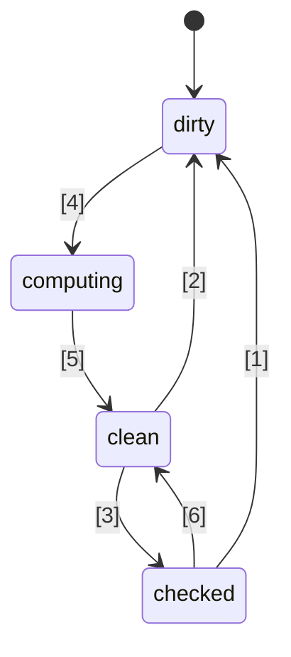
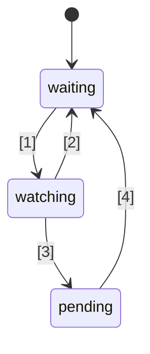

# 🚦 JavaScript Signals 標準提案 🚦


第一階段（[說明](https://tc39.es/process-document/)）

TC39 提案推動者：Daniel Ehrenberg、Yehuda Katz、Jatin Ramanathan、Shay Lewis、Kristen Hewell Garrett、Dominic Gannaway、Preston Sego、Milo M、Rob Eisenberg

原始作者：Rob Eisenberg 和 Daniel Ehrenberg

本文檔描述了 JavaScript 中 signals 的早期共識方向，類似於 Promises/A+ 的努力，該標準在 ES2015 中由 TC39 標準化為 Promises。你可以使用 [polyfill](https://github.com/proposal-signals/signal-polyfill) 親自試用。

與 Promises/A+ 類似，本次努力聚焦於協調 JavaScript 生態系統。如果這種協調成功，便有可能基於這些經驗誕生一項標準。多個框架作者正在這裡合作，共同建立一個可支援其反應核心的通用模型。目前草案基於 [Angular](https://angular.io/)、[Bubble](https://bubble.io/)、[Ember](https://emberjs.com/)、[FAST](https://www.fast.design/)、[MobX](https://mobx.js.org/)、[Preact](https://preactjs.com/)、[Qwik](https://qwik.dev/)、[RxJS](https://rxjs.dev/)、[Solid](https://www.solidjs.com/)、[Starbeam](https://www.starbeamjs.com/)、[Svelte](https://svelte.dev/)、[Vue](https://vuejs.org/)、[Wiz](https://blog.angular.io/angular-and-wiz-are-better-together-91e633d8cd5a) 等作者/維護者的設計反饋，以及更多...

與 Promises/A+ 不同的是，我們並不試圖解決一個面向開發者的共通 API，而是精確釐清底層 signal graph 的核心語意。本提案確實包含一個具體的 API，但這個 API 並不是針對大多數應用開發者設計的。相反，這裡的 signal API 更適合框架在其之上構建，通過共通的 signal graph 和自動追蹤機制實現互操作性。

本提案計畫在進入下一階段前，進行大量早期原型驗證，包括整合進多個框架中。我們只會在 Signals 能夠實際適用於多個框架並且能夠帶來實質超越框架自身 signals 的優勢時，才考慮標準化。希望透過大量早期原型驗證取得這些資訊。詳情請見下方「狀態與開發計畫」。

## 背景：為什麼需要 Signals？

為了開發複雜的使用者介面（UI），JavaScript 應用程式開發者需要有效地儲存、計算、失效、同步，並將狀態推送到應用程式的視圖層。UI 通常不僅僅是管理單一值，還常常涉及渲染取決於複雜樹狀結構的計算狀態，而這些狀態本身也可能來自其他計算。Signals 的目標是為這類應用狀態管理提供基礎設施，讓開發者可以專注於業務邏輯，而非這些重複性的細節。

類似 signal 的結構在非 UI 場景下也被證明非常有用，特別是在建構系統（build systems）中用來避免不必要的重建。

Signals 在反應式程式設計中用來消除應用程式中手動更新的需求。

> 一種基於狀態變化進行更新的宣告式程式設計模型。

摘自 _[What is Reactivity?](https://www.pzuraq.com/blog/what-is-reactivity)_。

#### 範例 - 原生 JS 計數器

給定一個變數 `counter`，你想在 DOM 中渲染這個計數器是偶數還是奇數。每當 `counter` 改變時，你希望用最新的奇偶性更新 DOM。在原生 JS 中，可能會這麼寫：

```js
let counter = 0;
const setCounter = (value) => {
  counter = value;
  render();
};

const isEven = () => (counter & 1) == 0;
const parity = () => isEven() ? "even" : "odd";
const render = () => element.innerText = parity();

// 模擬外部對 counter 的更新...
setInterval(() => setCounter(counter + 1), 1000);
```
> [!NOTE]  
> 這裡為示範目的而使用全域變數。正確的狀態管理有很多解決方案，本提案中的範例旨在盡可能精簡。此提案並不鼓勵使用全域變數。

這樣寫有以下幾個問題...

* `counter` 的設置繁瑣且樣板程式碼多。
* `counter` 狀態與渲染系統高度耦合。
* 如果 `counter` 改變但 `parity` 沒有（例如 counter 從 2 變為 4），則我們做了不必要的 parity 計算和渲染。
* 如果我們的 UI 另一部分只想在 `counter` 更新時渲染怎麼辦？
* 如果我們的 UI 另一部分只依賴於 `isEven` 或 `parity` 呢？

即使在這種相對簡單的情境下，也會很快出現許多問題。我們可以嘗試通過對 `counter` 引入 pub/sub（發布/訂閱）來解決。這樣可以讓更多 `counter` 的消費者訂閱以新增自己的狀態變更反應。

然而，仍然存在以下問題：

* 渲染函式僅依賴於 `parity`，卻必須「知道」實際上需要訂閱 `counter`。
* 若想只根據 `isEven` 或 `parity` 來更新 UI，不直接與 `counter` 互動是不可能的。
* 樣板程式碼變多了。每次使用時，不只是呼叫函式或讀取變數，而是還要訂閱並在那裡做更新。管理退訂也特別複雜。

現在，我們可以不僅給 `counter`，也給 `isEven` 和 `parity` 加入 pub/sub。然後必須讓 `isEven` 訂閱 `counter`、`parity` 訂閱 `isEven`、`render` 訂閱 `parity`。不幸的是，我們的樣板程式碼爆炸了，而且還要維護大量訂閱紀錄，如果沒妥善清理，還可能導致記憶體洩漏災難。於是，雖然解決了一些問題，卻又產生了全新類型的問題和大量程式碼。更糟的是，系統中每一個狀態都要經歷這一套。

### Signals 介紹

在 UI 框架中，模型與視圖的資料繫結抽象一直是多種程式語言 UI 框架的核心，儘管 JS 或 Web 平台本身未內建這類機制。在 JS 框架與函式庫內，有大量關於如何表示這種繫結的實驗，經驗證明，單向資料流與一個作為一等公民的資料類型（代表某個狀態單元或由其他資料推導出的計算單元，現在常稱為「Signal」）結合，有極大的威力。
這種一等公民的反應值方法，似乎最早在 2010 年 [Knockout](https://knockoutjs.com/) [開源 JavaScript Web 框架](https://blog.stevensanderson.com/2010/07/05/introducing-knockout-a-ui-library-for-javascript/) 中流行起來。此後，產生了許多不同的變體與實作。在過去 3-4 年間，Signal 原語與相關方法獲得更多關注，幾乎每個現代 JavaScript 函式庫或框架都有類似概念，名稱各異。

要了解 Signals，讓我們以 Signal API（詳見下文）重構上述範例。

#### 範例 - Signals 計數器

```js
const counter = new Signal.State(0);
const isEven = new Signal.Computed(() => (counter.get() & 1) == 0);
const parity = new Signal.Computed(() => isEven.get() ? "even" : "odd");

// 函式庫或框架根據其他 Signal 原語定義副作用
declare function effect(cb: () => void): (() => void);

effect(() => element.innerText = parity.get());

// 模擬外部對 counter 的更新...
setInterval(() => counter.set(counter.get() + 1), 1000);
```

我們可以立刻看出幾點：

* 已經消除了前例中 `counter` 變數周圍的繁雜樣板。
* 有一個統一的 API 來處理值、計算和副作用。
* 不再有 `counter` 與 `render` 之間的循環參考問題或顛倒的依賴關係。
* 不需手動訂閱，也無需額外的紀錄管理。
* 有控制副作用時機/排程的手段。

Signals 帶來的好處，遠不止 API 表面看到的這些：
* **自動依賴追蹤** - 計算型 Signal 會自動發現它所依賴的其他 Signal，無論這些 Signal 是簡單值還是其他運算。
* **延遲求值** - 計算不會在宣告時立即執行，也不會在其依賴變更時馬上執行。只有在明確要求其值時才會執行。
* **記憶體快取** - 計算型 Signal 會快取其最後一次的值，因此只要其依賴沒有變更，無論被存取多少次，都不需要重新計算。

## 將 Signals 標準化的動機

#### 互通性

每個 Signal 的實作都有自己的自動追蹤機制，用於記錄在評估計算型 Signal 時遇到的來源。這使得在不同框架間分享模型、元件和函式庫變得困難——它們往往會與其視圖引擎產生虛假的耦合（因為 Signals 通常是 JS 框架的一部分）。

本提案的目標是徹底將響應式模型從渲染視圖中解耦，使開發人員能夠在不重寫非 UI 代碼的情況下，遷移到新的渲染技術，或是在 JS 中開發可在不同情境下部署的共用響應式模型。不幸的是，由於版本控制和重複問題，僅靠 JS 層級函式庫很難實現高度的共用——內建功能能提供更強的共用保證。

#### 效能／記憶體使用

由於常用函式庫內建後能減少傳送的程式碼，理論上總會有些微效能提升，但 Signals 的實作通常相當精簡，因此我們不預期這個效益會很大。

我們推測，Signal 相關資料結構和演算法的原生 C++ 實作在效率上可略勝於 JS 實作，差異為常數因子。然而，預期不會有任何演算法上的變動，與 polyfill 實作無異；引擎不會在這裡有「魔法」，響應式的演算法本身將被明確且無歧義地定義。

冠軍小組預計會開發多種 Signal 實作，並用來探討這些效能的可能性。

#### 開發工具（DevTools）

在現有的 JS 語言 Signal 函式庫中，追蹤以下事項可能會很困難：
* 一連串計算型 Signal 的呼叫堆疊，顯示錯誤的因果鏈
* Signal 之間的參考圖——當一個依賴於另一個時，這在偵錯記憶體使用時很重要

內建的 Signal 可使 JS 執行環境與開發工具有機會更好地支援 Signal 的檢查，特別是在除錯或效能分析時，不論是內建於瀏覽器還是透過共用擴充。現有的工具如元素檢查器、效能快照和記憶體分析器都可以更新，專門在資訊展示時高亮顯示 Signal。

#### 次要效益

##### 標準函式庫的好處

一般而言，JavaScript 的標準函式庫相當精簡，但 TC39 的趨勢是讓 JS 成為一個「內建電池」的語言，提供高品質、內建的功能。例如 Temporal 取代 moment.js，還有許多小功能，如 `Array.prototype.flat` 和 `Object.groupBy`，取代了許多 lodash 的用例。好處包括更小的 bundle 大小、提升的穩定性與品質、加入新專案時需要學習的東西更少，以及 JS 開發者之間更通用的詞彙。

##### HTML/DOM 整合（未來的可能性）

目前 W3C 及瀏覽器實作者正在致力於將原生樣板引入 HTML（[DOM Parts][wicg-pr-1023] 及 [Template Instantiation][wicg-propsal-template-instantiation]）。此外，W3C Web Components CG 也在探索將 Web Components 擴展為完全宣告式 HTML API 的可能性。要實現這兩個目標，HTML 最終都需要一個響應式原語。此外，社群也提出了許多透過 Signal 整合提升 DOM 易用性的想像與需求。

[wicg-pr-1023]: https://github.com/WICG/webcomponents/pull/1023
[wicg-propsal-template-instantiation]: https://github.com/WICG/webcomponents/blob/gh-pages/proposals/Template-Instantiation.md

> 注意，此整合將會是之後的獨立工作，並不包含在本提案內。

##### 生態資訊交流（*並非* 推出標準的理由）

標準化的努力有時即使不改變瀏覽器，也能在「社群」層面帶來幫助。Signals 的討論已經匯聚了許多不同框架的作者，深入討論了響應式本質、演算法與互通性。這已經帶來益處，但這不足以成為 JS 引擎和瀏覽器納入的理由；只有當 Signals 帶來超越生態資訊交流的重大效益時，才應加入 JavaScript 標準。

## Signals 的設計目標

事實證明，現有的 Signal 函式庫在核心設計上大同小異。本提案旨在建立在這些成功之上，實現許多函式庫的重要特性。

### 核心功能

* 一個代表狀態的 Signal 類型，即可寫入的 Signal。這是一個可供他人讀取的值。
* 一個計算型／記憶型／派生型 Signal 類型，依賴於其他 Signal，並以延遲計算和快取方式運作。
    * 計算是延遲的，這代表計算型 Signal 預設不會在其依賴變動時立即重新計算，只有在被讀取時才會執行。
    * 計算是「[無故障](https://en.wikipedia.org/wiki/Reactive_programming#Glitches)」的，代表永遠不會執行不必要的計算。這表示，當應用程式讀取計算型 Signal 時，會對圖中可能髒掉的部分做拓撲排序，消除重複運算。
    * 計算會快取，如果自上次依賴變更後，沒有任何依賴變動，那麼計算型 Signal 在被存取時*不會*重新計算。
    * 無論是計算型 Signal 還是狀態型 Signal，都可以自訂比對方式，用來決定依賴它們的進一步計算型 Signal 是否需要更新。
* 對於計算型 Signal 的依賴（或巢狀依賴）「髒掉」並變更，導致該 Signal 的值可能過時時，能夠做出反應。
    * 這個反應用來安排日後需執行的更重要工作。
    * Effect 是以這些反應加上框架層級的排程來實作。
    * 計算型 Signal 需要能夠反應自己是否被註冊為這些反應的（巢狀）依賴。
* 允許 JS 框架自訂排程。沒有強制 Promise 風格的內建排程。
    * 需要同步反應，以便根據框架邏輯安排日後的工作。
    * 寫入是同步且立即生效的（框架若要批次寫入可在其上層實作）。
    * 可以將檢查 effect 是否「髒掉」與實際執行 effect 分開（允許兩階段 effect 排程器）。
* 能夠在*不*觸發依賴記錄的情況下讀取 Signal（`untrack`）
* 允許組合使用不同 codebase 的 Signal／響應式機制，例如：
    * 就追蹤／響應式本身而言，能一起使用多個框架（但有例外，見下文）
    * 與框架無關的響應式資料結構（如遞迴響應式 store proxy、響應式 Map、Set、Array 等）

### 健全性（Soundness）

* 勸阻或禁止對同步反應的天真濫用。
    * 健全性風險：若使用不當，可能暴露「[故障](https://en.wikipedia.org/wiki/Reactive_programming#Glitches)」：若在設定 Signal 時立即渲染，最終用戶可能會看到不完整的應用狀態。因此，此功能應僅用於在應用邏輯完成後，智慧地安排後續工作。
    * 解決方案：禁止在同步反應回呼中讀寫任何 Signal
* 勸阻 `untrack` 的使用並標示其不健全性
    * 健全性風險：允許建立其值依賴於其他 Signal 的計算型 Signal，但當這些 Signal 變動時卻不會更新。應僅在未追蹤的存取不會影響運算結果時使用。
    * 解決方案：API 在名稱上標記為「unsafe」。
* 注意：本提案允許在計算型和 effect Signal 中讀寫 Signal，且不限制讀之後的寫，儘管有健全性風險。這樣決定是為了在與框架整合時保留彈性和相容性。

### 外部 API

* 必須是一個穩固的基礎，能讓多個框架實作其 Signal／響應式機制。
    * 應能作為遞迴 store proxy、基於裝飾器的類別欄位響應式，以及 `.value` 與 `[state, setState]` 風格 API 的良好基礎。
    * 語意能表達不同框架啟用的有效模式。例如，這些 Signal 應能作為即時反映寫入或寫入後批次套用的基礎。
* 若此 API 能被 JavaScript 開發者直接使用會更好。
    * 若某功能與生態系概念相符，使用通用詞彙較佳。
        * 但重要的是不要完全照搬相同名稱！
    * 在「JS 開發者可用性」與「提供框架所有介面」間取得平衡
        * 構想：提供所有介面，但盡可能在誤用時加上錯誤提示。
        * 構想：將細微 API 放在 `subtle` 命名空間，類似 [`crypto.subtle`](https://developer.mozilla.org/en-US/docs/Web/API/Crypto/subtle)，區分實作框架或開發工具等進階用途的 API 與日常應用開發用來實例化 Signal 的 API。
* 必須能以良好效能實作與使用——外部 API 不會造成太多額外負擔
    * 允許子類化，讓框架能加上自己的方法和欄位，包括私有欄位。這對避免框架層級多餘配置很重要。詳見下方「記憶體管理」。

### 記憶體管理

* 若可行：若沒有任何活動引用會在未來讀取，計算型 Signal 應能被垃圾回收，即使它連結在仍存活的更大圖中（例如，讀取了一個仍存活的狀態）。
* 請注意，目前大多數框架都需要顯式釋放（dispose）已計算的 Signal，尤其當它們與其他仍存活的 Signal 圖有任何引用關係時。
* 當它們的生命週期與 UI 元件綁定時，這其實並不算太糟，因為效果（effects）本來也需要被釋放。
* 如果用這種語義執行的代價太高，那麼我們應該在下方 API 中新增顯式的釋放（或「解除連結 unlinking」）計算型 Signal 的方法，目前 API 尚未提供此功能。
* 另一個相關目標：最小化配置（allocation）次數，例如：
    * 建立一個可寫 Signal 時（避免兩個獨立的閉包和一個陣列）
    * 實作 effect（避免每個 reaction 都建立一個閉包）
    * 在觀察 Signal 變化的 API 裡，避免建立額外的暫時性資料結構
    * 解決方案：以類別為基礎的 API，允許重複使用子類別定義的方法與欄位

## API 草案

以下是一個 Signal API 的初步想法。請注意這僅是早期草稿，我們預期未來會有所變動。讓我們從完整的 `.d.ts` 開始，以掌握整體架構，然後再討論每個細節的意義。

```ts
interface Signal<T> {
    // 取得 signal 的值
    get(): T;
}

namespace Signal {
    // 可讀寫的 Signal
    class State<T> implements Signal<T> {
        // 建立一個初始值為 t 的 state Signal
        constructor(t: T, options?: SignalOptions<T>);

        // 取得 signal 的值
        get(): T;

        // 設定 state Signal 的值為 t
        set(t: T): void;
    }

    // 依賴其他 Signal 的公式型 Signal
    class Computed<T = unknown> implements Signal<T> {
        // 建立一個 Signal，其值為 callback 回傳的結果。
        // Callback 執行時，this 指向該 signal。
        constructor(cb: (this: Computed<T>) => T, options?: SignalOptions<T>);

        // 取得 signal 的值
        get(): T;
    }

    // 此命名空間包含「進階」功能，建議由框架作者使用，而非應用程式開發者。
    // 類似於 `crypto.subtle`
    namespace subtle {
        // 執行 callback，且停用所有追蹤功能
        function untrack<T>(cb: () => T): T;

        // 取得目前正在追蹤 signal 讀取的 computed signal（如果有的話）
        function currentComputed(): Computed | null;

        // 回傳最近一次評估時，此 signal 所參考的所有 signal 的有序列表。
        // 對於 Watcher，則列出其監看的 signal 集合。
        function introspectSources(s: Computed | Watcher): (State | Computed)[];

        // 回傳此 signal 所屬的 Watchers，以及最近一次評估時讀取此 signal 的所有 Computed signals，
        // 如果該 computed signal（遞迴地）被監看。
        function introspectSinks(s: State | Computed): (Computed | Watcher)[];

        // 如果此 signal 是「活躍」的（即被 Watcher 監看，
        // 或被（遞迴）活躍的 Computed signal 讀取），則回傳 true。
        function hasSinks(s: State | Computed): boolean;

        // 如果此元素是「反應式」的，即依賴其他 signal，則回傳 true。
        // 當 Computed 的 hasSources 為 false 時，將永遠回傳同一常數值。
        function hasSources(s: Computed | Watcher): boolean;

        class Watcher {
            // 當 Watcher 的（遞迴）來源被寫入時，呼叫此 callback，
            // 若自上次 `watch` 呼叫以來尚未被呼叫。
            // 在 notify 執行期間，不能讀寫任何 signal。
            constructor(notify: (this: Watcher) => void);

            // 將這些 signals 加入 Watcher 監看的集合，並設定下一次這些 signal（或其依賴）變動時，
            // 會執行 notify callback。
            // 也可不帶參數呼叫以重設「已通知」狀態，使 notify callback 能再次被呼叫。
            watch(...s: Signal[]): void;

            // 從監看集合中移除這些 signal（例如，用於已釋放的 effect）
            unwatch(...s: Signal[]): void;

            // 回傳 Watcher 監看集合中仍為 dirty 的來源，或是具有 dirty/pending 來源但尚未重新評估的 computed signal
            getPending(): Signal[];
        }

        // 監看或不再被監看時的觀察 hooks
        var watched: Symbol;
        var unwatched: Symbol;
    }

    interface SignalOptions<T> {
        // 舊值與新值之間的自訂比較函式，預設為 Object.is。
        // Signal 會作為 this 值傳入以供 context 使用。
        equals?: (this: Signal<T>, t: T, t2: T) => boolean;
```
```ts
// Callback called when isWatched becomes true, if it was previously false
[Signal.subtle.watched]?: (this: Signal<T>) => void;

// Callback called whenever isWatched becomes false, if it was previously true
[Signal.subtle.unwatched]?: (this: Signal<T>) => void;
}
}
```

### Signal 的運作方式

Signal 代表一個隨時間可能變化的資料儲存格。Signal 可以是「狀態型」（僅以手動方式設置的值），也可以是「計算型」（基於其他 Signal 的公式）。

計算型 Signal 的運作方式是：在其評估過程中，自動追蹤讀取了哪些其他 Signal。當讀取計算型 Signal 時，它會檢查先前記錄的依賴項是否有變更，如果有就重新計算自身。當多個計算型 Signal 巢狀時，所有追蹤的歸因都會集中在最內層的那一個。

計算型 Signal 是惰性（即拉取式）的：只有在被存取時才會重新計算，即使其中一個依賴項較早前已經改變。

傳遞給計算型 Signal 的回呼通常應該是「純粹」的，也就是說，必須是其他 Signal 的確定性、無副作用的函數。同時，回呼被呼叫的時機是確定性的，因此可以小心地使用副作用。

Signal 具有明顯的快取／記憶化特性：狀態型與計算型 Signal 都會記住其目前的值，只有在它們實際變更時，才會觸發引用它們的計算型 Signal 重新計算。甚至不需要重複比較舊值和新值——比較只會在來源 Signal 被重設或重新計算時進行一次，而 Signal 機制會追蹤哪些引用該 Signal 的項目尚未根據新值更新。在內部，這通常透過「圖著色」來實現，如（Milo 的部落格文章）所述。

計算型 Signal 會動態追蹤其依賴項——每次運行時，可能依賴不同的項目，而這個精確的依賴集會在 Signal 圖中保持最新。這表示，如果你只在某個分支上需要某個依賴，而先前的計算走的是另一個分支，那麼對於那個暫時未使用的值的變更，不會導致計算型 Signal 被重新計算，即使被拉取。

與 JavaScript 的 Promise 不同，Signal 的所有操作都是同步執行的：
- 將 Signal 設為新值是同步的，這會立即反映在隨後讀取任何依賴它的計算型 Signal 上。這個變異沒有內建的批次處理。
- 讀取計算型 Signal 是同步的——它們的值總是可用。
- 如下所述，Watcher 的 `notify` 回呼會在觸發它的 `.set()` 呼叫期間同步執行（但會在圖著色完成後）。

和 Promise 一樣，Signal 也可以表示錯誤狀態：如果計算型 Signal 的回呼拋出錯誤，該錯誤會像其他值一樣被快取，每次讀取 Signal 都會重新拋出該錯誤。

### Signal 類別解析

一個 `Signal` 實例代表可以讀取一個動態變化且其更新會被追蹤的值的能力。它也隱含地包含了訂閱該 Signal 的能力，這是透過其他計算型 Signal 的追蹤存取來實現的。

這裡的 API 設計是為了符合 Signal 生態圈在「signal」、「computed」和「state」等名稱上的粗略共識。不過，對計算型和狀態型 Signal 的存取是透過 `.get()` 方法，而這與所有流行的 Signal API 不同，它們要麼使用 `.value` 存取器，要麼使用 `signal()` 呼叫語法。

API 設計目標是減少資源分配數量，使 Signal 適合嵌入於 JavaScript 框架中，同時達到與現有框架專用 Signal 相同或更好的效能。這意味著：
- 狀態型 Signal 是單一可寫物件，可以從同一參考中存取和設置。（詳見下方「能力分離」章節的影響。）
- 狀態型與計算型 Signal 均可被子類化，方便框架通過公開或私有類別欄位（以及使用該狀態的方法）添加額外屬性。
- 各種回呼（如 `equals`、計算型回呼）都會以對應的 Signal 作為 `this` 值呼叫，這樣每個 Signal 不需要新建閉包。上下文可保存在 Signal 本身的額外屬性中。

此 API 強制執行的一些錯誤條件：
- 遞迴讀取計算型 Signal 屬於錯誤行為。
- Watcher 的 `notify` 回呼不可讀取或寫入任何 Signal。
- 如果計算型 Signal 的回呼拋出錯誤，則後續存取該 Signal 會重拋快取的錯誤，直到依賴項之一改變並重新計算。

未被強制執行的一些條件：
- 計算型 Signal 可以在其回呼中同步寫入其他 Signal。
- Watcher 的 `notify` 回呼所佇列的工作可能會讀寫 Signal，這使得可以用 Signal 複製[經典 React 反模式](https://react.dev/learn/you-might-not-need-an-effect)！

### 實作 effect

上面定義的 `Watcher` 介面為實作典型 JS effect API 提供了基礎：即當其他 Signal 變化時重新執行回呼，純粹用於副作用。最初範例中使用的 `effect` 函數可定義如下：

```ts
// 這個函數通常存在於函式庫／框架中，而非應用程式碼
// 注意：這個排程邏輯過於基礎，不建議複製／貼上。
let pending = false;

let w = new Signal.subtle.Watcher(() => {
    if (!pending) {
        pending = true;
        queueMicrotask(() => {
            pending = false;
            for (let s of w.getPending()) s.get();
            w.watch();
        });
    }
});

// 一個 effect Signal，當其依賴可能改變時，會將自身的讀取排入 microtask queue
export function effect(cb) {
    let destructor;
    let c = new Signal.Computed(() => { destructor?.(); destructor = cb(); });
    w.watch(c);
    c.get();
    return () => { destructor?.(); w.unwatch(c) };
}
```

Signal API 本身並未內建如 `effect` 這類函數。這是因為 effect 排程非常微妙，且常常結合框架的渲染週期及其他高階、框架專屬的狀態或策略，而 JS 本身無法存取這些。

來看一下這裡使用的不同操作：傳遞給 `Watcher` 建構子的 `notify` 回呼，是當 Signal 從「乾淨」狀態（我們知道快取已初始化且有效）進入「已檢查」或「髒」狀態（快取可能有效也可能無效，因為至少有一個遞迴依賴的狀態已被更改）時會被呼叫的函數。

`notify` 的呼叫最終是由某個狀態型 Signal 的 `.set()` 呼叫所觸發。這個呼叫是同步的：它發生在 `.set` 返回之前。但不必擔心這個回呼會在 Signal 圖尚未完全處理時觀察到其狀態，因為在 `notify` 回呼期間，任何 Signal 都不可被讀寫，即使是在 `untrack` 呼叫中也是如此。由於 `notify` 是在 `.set()` 期間呼叫的，它會中斷另一段尚未完成的邏輯。若要在 `notify` 中讀寫 Signal，應安排稍後執行的工作，例如將 Signal 記錄在清單中，或像上面一樣用 `queueMicrotask`。

請注意，即使不使用 `Signal.subtle.Watcher`，只要定時輪詢計算型 Signal（如 Glimmer 所做），也可以有效地運用 Signal。但許多框架發現，同步執行這些排程邏輯通常十分有用，因此 Signal API 也包含了這個能力。

計算型與狀態型 Signal 都像其他 JS 值一樣會被垃圾回收。不過 Watcher 有一種特殊的方式能讓物件保持存活：任何被 Watcher 監看的 Signal 只要底層狀態仍可達，就會保持存活，因為這些狀態可能會觸發未來的 `notify` 呼叫（進而觸發後續的 `.get()`）。因此，請記得呼叫 `Watcher.prototype.unwatch` 來清理 effect。

### 一個不安全的逃生出口

`Signal.subtle.untrack` 是一個逃生出口，允許在*不*追蹤這些讀取的情況下讀取 Signal。這種能力是不安全的，因為它可能會產生依賴其他 Signal 但在這些 Signal 變化時卻不會更新自身的計算型 Signal。只有在未追蹤的存取不會改變計算結果時才應使用。

<!--
TODO: Show example where it's a good idea to use untrack

### 使用 watched/unwatched
-->
TODO: 展示如何將 Observable 轉換為僅在被 effect 使用時訂閱的 computed signal 的範例

TODO: 展示代表 fetch 針對某個 state 結果的 computed signal 範例，並且可被取消

### SSR 的內省

TODO: 展示如何序列化 signal graph 的運作方式

TODO: 展示如何使用幾個 signal，從 state「水合」為 computed

-->

### 暫時省略

這些功能未來可能會加入，但目前草案尚未包含。這些功能的省略，是因為各框架在設計空間尚未有明確共識，並且已經證明可以透過本文所述 Signals 機制上的其他方法來解決。不過，這些省略遺憾地限制了各框架之間的互操作性潛力。隨著依據本文描述的 Signals 原型逐步產生，將會重新檢視這些省略是否為適當決定。

* **非同步（Async）**：在此模型中，Signals 總是可以同步取得評估結果。但實務上，常常需要有某些非同步流程會設定 signal，並且要能理解 signal 目前是否處於「載入中」狀態。一個簡單的做法是用例外來表達 loading 狀態，且 computed signal 的例外快取行為與此技巧能夠一定程度地組合。更進階的技術討論可見於 [Issue #30](https://github.com/proposal-signals/proposal-signals/issues/30)。
* **交易（Transactions）**：在畫面轉換時，通常需要同時維持「來源」與「目標」狀態的即時狀態。「目標」狀態會在背景渲染，直到準備好交換（提交交易），而「來源」狀態則持續可互動。要同時維持兩個狀態，需要「分叉」 signal graph 的狀態，甚至可能需要同時支援多個暫存中的轉換。相關討論見 [Issue #73](https://github.com/proposal-signals/proposal-signals/issues/73)。

有些[便利方法](https://github.com/proposal-signals/proposal-signals/issues/32)也同樣被省略。

## 狀態與開發計畫

本提案已列入 2024 年 4 月 TC39 議程，階段為 Stage 1。目前可以視為「Stage 0」。

本提案已有一個[相容實作（polyfill）](https://github.com/proposal-signals/signal-polyfill)，並包含一些基本測試。有些框架作者已經開始嘗試用此 signal 實作來替換現有方案，但此用法仍處於初期階段。

Signal 提案的協作者們希望在推進本提案時特別**保守**，以免最後推出了後悔且實際上沒人採用的東西。我們計畫執行以下 TC39 程序未要求的額外任務，以確保本提案的進度正確：

在進入 Stage 2 前，我們計畫：
- 開發多個達到產品等級、穩健且經過良好測試（例如通過多個框架測試及 test262 風格測試）、效能具競爭力（經 signal/框架基準集嚴格驗證）的 polyfill 實作。
- 將擬議的 Signal API 整合進大量我們認為具代表性的 JS 框架，並讓部分大型應用以此為基礎運作。測試其在這些情境下的效能與正確性。
- 充分理解 API 的潛在擴充空間，並決定哪些（如有）應納入本提案。

## Signal 演算法

本節說明每個對 JavaScript 暴露的 API，其所實作的演算法。可視為一份原型規格，雖然內容開放修正，但有助於先釐清一組可能的語意。

演算法的幾個重點：
- 在 computed 內部對 Signals 的讀取順序很重要，並可藉由某些回呼（如 `Watcher` 被觸發、`equals`、`new Signal.Computed` 的第一個參數、`watched`/`unwatched` 回呼）執行的順序觀察到。這意味著 computed Signal 的來源必須是有順序地儲存。
- 這四個回呼都可能拋出例外，且這些例外會以可預期方式傳遞給呼叫的 JS 程式碼。這些例外*不會*導致演算法中止或讓 graph 處於半處理狀態。若在 Watcher 的 `notify` 回呼中發生錯誤，該例外會傳給觸發它的 `.set()` 呼叫，若有多個例外則包成 AggregateError 丟出。其他例外（包括 `watched`/`unwatched`？）則存於 Signal 的值，當讀取時再拋出，且這類會拋出例外的 Signal 也能如一般有值的 Signal 一樣被標記為 `~clean~`。
- 對於未被「監看」（未被任何 Watcher 觀察）的 computed signal，演算法特別避免循環依賴，讓這些 signal 能獨立於 graph 其他部分被垃圾回收。內部可用「世代編號（generation number）」系統實作，且優化實作可能還會有每個節點的區域世代編號，或避免追蹤某些已被監看的 signal 的編號。

### 隱含的全域狀態

Signal 演算法需要參考某些全域狀態。這些狀態在整個執行緒（或「代理」）內全域有效。

- `computing`：目前因 `.get` 或 `.run` 呼叫而正在重新計算的最內層 computed 或 effect Signal，或為 `null`。初始值為 `null`。
- `frozen`：布林值，表示目前是否有回呼正在執行且要求不得修改 graph。初始值為 `false`。
- `generation`：自 0 開始遞增的整數，用來追蹤值的新舊並避免循環依賴。

### `Signal` 命名空間

`Signal` 是一個普通物件，作為 Signal 相關類別與函式的命名空間。

`Signal.subtle` 是一個類似的內部命名空間物件。

### `Signal.State` 類別

#### `Signal.State` 內部欄位

- `value`：state signal 的目前值
- `equals`：變更值時使用的比較函式
- `watched`：signal 首次被 effect 觀察時呼叫的回呼
- `unwatched`：signal 不再被 effect 觀察時呼叫的回呼
- `sinks`：依賴此 signal 的所有被監看的 signals 集合

#### 建構子：`Signal.State(initialValue, options)`

1. 設定本 Signal 的 `value` 為 `initialValue`。
1. 設定本 Signal 的 `equals` 為 options?.equals
1. 設定本 Signal 的 `watched` 為 options?.[Signal.subtle.watched]
1. 設定本 Signal 的 `unwatched` 為 options?.[Signal.subtle.unwatched]
1. 設定本 Signal 的 `sinks` 為空集合

#### 方法：`Signal.State.prototype.get()`

1. 若 `frozen` 為 true，丟出例外。
1. 若 `computing` 不為 `undefined`，將本 Signal 加入 `computing` 的 `sources` 集合。
1. 備註：只有當被 Watcher 監看時，才會把 `computing` 加入本 Signal 的 `sinks` 集合。
1. 回傳本 Signal 的 `value`。

#### 方法：`Signal.State.prototype.set(newValue)`

1. 若目前執行環境為 `frozen`，丟出例外。
1. 以本 Signal 與傳入值執行「設定 Signal 值」演算法。
1. 若該演算法回傳 `~clean~`，則回傳 undefined。
1. 將本 Signal 所有 `sinks` 的 `state` 設為（若為 Computed Signal）`~dirty~`（若其先前為 clean），或（若為 Watcher）`~pending~`（若其先前為 `~watching~`）。
1. 將所有這些 sinks 的 Computed Signal 依賴（遞迴）設為 `~checked~`（若其先前為 `~clean~`；若為 dirty 則維持），或 Watchers 設為 `~pending~`（若先前為 `~watching~`）。
1. 對於遞迴搜尋中遇到的每個先前為 `~watching~` 的 Watcher，依深度優先順序：
    1. 設定 `frozen` 為 true。
    1. 呼叫其 `notify` 回呼（若有例外則記錄，但忽略 `notify` 的回傳值）。
    1. 還原 `frozen` 為 false。
    1. 將 Watcher 的 `state` 設為 `~waiting~`。
1. 若任何 `notify` 回呼拋出例外，則於所有 `notify` 執行完畢後將例外傳遞給呼叫端；若有多個例外則包成 AggregateError 丟出。
1. 回傳 undefined。

### `Signal.Computed` 類別

#### `Signal.Computed` 狀態機
`Computed Signal` 的 `state` 可能為下列其中之一：

- `~clean~`：此 Signal 的值已存在，且已知不為過時狀態。
- `~checked~`：此 Signal 的（間接）來源已變更；此 Signal 擁有一個值，但該值_可能_已過時。是否過時僅能在所有直接來源都已評估後得知。
- `~computing~`：此 Signal 的 callback 目前正因 `.get()` 呼叫而被執行。
- `~dirty~`：此 Signal 的值已知為過時，或從未被評估過。

狀態轉換圖如下：



狀態轉換說明如下：
| 編號 | 從 | 到 | 條件 | 演算法 |
| ---- | -- | -- | ---- | ------ |
| 1 | `~checked~` | `~dirty~` | 此 Signal 的直接來源為 computed signal，且該來源已被評估且值已變更。 | 演算法：重新計算 dirty 的 computed Signal |
| 2 | `~clean~` | `~dirty~` | 此 Signal 的直接來源為 State，且該來源被設為與先前不同的值。 | 方法：`Signal.State.prototype.set(newValue)` |
| 3 | `~clean~` | `~checked~` | 此 Signal 的遞迴（但非直接）來源為 State，且該來源被設為與先前不同的值。 | 方法：`Signal.State.prototype.set(newValue)` |
| 4 | `~dirty~` | `~computing~` | 即將執行 `callback`。 | 演算法：重新計算 dirty 的 computed Signal |
| 5 | `~computing~` | `~clean~` | `callback` 已完成評估，且已回傳值或丟出例外。 | 演算法：重新計算 dirty 的 computed Signal |
| 6 | `~checked~` | `~clean~` | 此 Signal 的所有直接來源皆已評估且皆未變更，因此現已確定非過時。 | 演算法：重新計算 dirty 的 computed Signal |

#### `Signal.Computed` 內部欄位

- `value`：Signal 先前快取的值，或若從未讀取則為 `~uninitialized~`。該值可能為例外，若讀取則會重新拋出。對於 effect signals 永遠為 `undefined`。
- `state`：可能為 `~clean~`、`~checked~`、`~computing~` 或 `~dirty~`。
- `sources`：此 Signal 所依賴的 Signals 的有序集合。
- `sinks`：依賴此 Signal 的 Signals 的有序集合。
- `equals`：於 options 中提供的 equals 方法。
- `callback`：用以取得 computed Signal 值的 callback，設為建構子傳入的第一個參數。

#### `Signal.Computed` 建構子

建構子將設定
- `callback` 為其第一個參數
- `equals` 根據 options 設定，若無則預設為 `Object.is`
- `state` 為 `~dirty~`
- `value` 為 `~uninitialized~`

配合 [AsyncContext](https://github.com/tc39/proposal-async-context)，傳入 `new Signal.Computed` 的 callback 會捕捉建構子調用時的快照，並於執行期間恢復該快照。

#### 方法：`Signal.Computed.prototype.get`

1. 若目前執行上下文為 `frozen`，或此 Signal 狀態為 `~computing~`，或此 Signal 為 Watcher 且正在 `computing` 一個 computed Signal，則拋出例外。
1. 若 `computing` 非 `null`，將此 Signal 加入 `computing` 的 `sources` 集合。
1. 注意：在此 Signal 尚未被 Watcher 監看前，不會將 `computing` 加入此 Signal 的 `sinks` 集合。
1. 若此 Signal 的狀態為 `~dirty~` 或 `~checked~`：重複下列步驟直到此 Signal 為 `~clean~`：
    1. 遞迴往上經由 `sources`，尋找最深、最左（即最早被觀察到）的、標記為 `~dirty~` 的 computed Signal（遇到 `~clean~` 的 computed Signal 則停止搜尋，並將本身作為最後搜尋對象）。
    1. 對該 Signal 執行「重新計算 dirty 的 computed Signal」演算法。
1. 此時，此 Signal 的狀態應為 `~clean~`，且所有遞迴來源皆非 `~dirty~` 或 `~checked~`。回傳此 Signal 的 `value`。若該值為例外，則重新拋出該例外。

### `Signal.subtle.Watcher` 類別

#### `Signal.subtle.Watcher` 狀態機

Watcher 的 `state` 可能為下列其中之一：

- `~waiting~`：`notify` callback 已被執行，或 Watcher 為新建立，但尚未主動監看任何 signals。
- `~watching~`：Watcher 正主動監看 signals，尚未有變更需執行 `notify` callback。
- `~pending~`：Watcher 的依賴已變更，但尚未執行 `notify` callback。

狀態轉換圖如下：



狀態轉換說明如下：
| 編號 | 從 | 到 | 條件 | 演算法 |
| ---- | -- | -- | ---- | ------ |
| 1 | `~waiting~` | `~watching~` | Watcher 的 `watch` 方法被呼叫。 | 方法：`Signal.subtle.Watcher.prototype.watch(...signals)` |
| 2 | `~watching~` | `~waiting~` | Watcher 的 `unwatch` 方法被呼叫，且最後一個被監看的 signal 已移除。 | 方法：`Signal.subtle.Watcher.prototype.unwatch(...signals)` |
| 3 | `~watching~` | `~pending~` | 某個被監看的 signal 可能已變更值。 | 方法：`Signal.State.prototype.set(newValue)` |
| 4 | `~pending~` | `~waiting~` | `notify` callback 已被執行。 | 方法：`Signal.State.prototype.set(newValue)` |

#### `Signal.subtle.Watcher` 內部欄位

- `state`：可能為 `~watching~`、`~pending~` 或 `~waiting~`
- `signals`：此 Watcher 正在監看的 Signals 的有序集合
- `notifyCallback`：當有變更時會被呼叫的 callback。設為建構子傳入的第一個參數。

#### 建構子：`new Signal.subtle.Watcher(callback)`

1. `state` 設為 `~waiting~`。
1. 初始化 `signals` 為空集合。
1. `notifyCallback` 設為傳入的 callback 參數。
使用 [AsyncContext](https://github.com/tc39/proposal-async-context) 時，傳遞給 `new Signal.subtle.Watcher` 的回呼函式*不會*閉包構造函式被呼叫時的快照，因此寫入時的上下文資訊是可見的。

#### 方法：`Signal.subtle.Watcher.prototype.watch(...signals)`

1. 如果 `frozen` 為 true，則拋出例外。
1. 如果任一參數不是 signal，則拋出例外。
1. 將所有參數附加到此物件的 `signals` 末尾。
1. 對於每一個新監看的 signal，按照從左到右的順序，
    1. 將此 watcher 作為 `sink` 加入該 signal。
    1. 如果這是第一個 sink，則遞迴向上加入來源，將該 signal 加為 sink。
    1. 設定 `frozen` 為 true。
    1. 如果有 `watched` 回呼函式則呼叫它。
    1. 將 `frozen` 回復為 false。
1. 如果 Signal 的 `state` 為 `~waiting~`，則將其設為 `~watching~`。

#### 方法：`Signal.subtle.Watcher.prototype.unwatch(...signals)`

1. 如果 `frozen` 為 true，則拋出例外。
1. 如果任一參數不是 signal，或不是此 watcher 監看的 signal，則拋出例外。
1. 對於參數中的每個 signal，按照從左到右的順序，
    1. 從此 Watcher 的 `signals` 集合中移除該 signal。
    1. 從該 Signal 的 `sink` 集合中移除此 Watcher。
    1. 如果該 Signal 的 `sink` 集合已經變為空，則從其所有來源中移除該 Signal 作為 sink。
    1. 設定 `frozen` 為 true。
    1. 如果有 `unwatched` 回呼函式則呼叫它。
    1. 將 `frozen` 回復為 false。
1. 如果此 watcher 現在沒有 `signals`，且其 `state` 為 `~watching~`，則將其設為 `~waiting~`。

#### 方法：`Signal.subtle.Watcher.prototype.getPending()`

1. 回傳一個陣列，包含 `signals` 中屬於 Computed Signals 且狀態為 `~dirty~` 或 `~pending~` 的子集。

### 方法：`Signal.subtle.untrack(cb)`

1. 令 `c` 為執行環境目前的 `computing` 狀態。
1. 將 `computing` 設為 null。
1. 呼叫 `cb`。
1. 將 `computing` 回復為 `c`（即使 `cb` 拋出例外也如此）。
1. 回傳 `cb` 的回傳值（如有例外則重新拋出）。

注意：untrack 並不會讓你脫離 `frozen` 狀態，該狀態被嚴格維護。

### 方法：`Signal.subtle.currentComputed()`

1. 回傳目前的 `computing` 值。

### 通用演算法

##### 演算法：重新計算 dirty 的 computed Signal

1. 清空此 Signal 的 `sources` 集合，並從這些來源的 `sinks` 集合中移除此 Signal。
1. 儲存先前的 `computing` 值，並將 `computing` 設為此 Signal。
1. 將此 Signal 的狀態設為 `~computing~`。
1. 執行此 computed Signal 的回呼函式，並以此 Signal 作為 this 值。儲存回傳值，若回呼函式拋出例外，則儲存該例外以便重新拋出。
1. 回復先前的 `computing` 值。
1. 對回呼函式的回傳值套用「設定 Signal 值」演算法。
2. 將此 Signal 的狀態設為 `~clean~`。
1. 若該演算法回傳 `~dirty~`：將此 Signal 的所有 sink 標記為 `~dirty~`（之前，sink 可能同時有 checked 和 dirty）。(或者，若此 Signal 無 watcher，則採用新的世代編號表示 dirty 狀態，或類似機制。)
1. 否則，若該演算法回傳 `~clean~`：此時，對於此 Signal 的每個 `~checked~` sink，如果該 Signal 的所有來源現在都是 clean，則同樣將該 Signal 標記為 `~clean~`。對於任何有 checked sink 的新 clean Signal，遞迴地套用此清理步驟於後續 sink。（或者，若無 watcher，則以某種方式標記，以便延遲清理。）

##### 設定 Signal 值演算法

1. 如果此演算法接收到一個值（而不是從重新計算 dirty 的 computed Signal 演算法傳來的需重新拋出的例外）：
    1. 呼叫此 Signal 的 `equals` 函式，傳入當前的 `value`、新值及此 Signal 作為參數。如果拋出例外，將該例外（供讀取時重新拋出）儲存為 Signal 的值，並繼續如同回呼回傳 false。
    1. 如果該函式回傳 true，則回傳 `~clean~`。
1. 將此 Signal 的 `value` 設為傳入參數。
1. 回傳 `~dirty~`

## 常見問題

**問**：現在就要將 Signals 標準化會不會太早？Signals 才在 2022 年成為熱門話題，難道不該給它們更多時間演化與穩定嗎？

**答**：目前網頁框架中的 Signals 發展，已經是超過十年持續演進的成果。隨著近年投資加速，幾乎所有主流程式框架都在趨近類似的 Signal 核心模型。本提案是眾多網頁框架領導者共同設計的產物，在未獲得各領域專家於不同上下文驗證前，不會推動標準化。

#### Signals 如何被使用？

**問**：內建 Signals 真的能被框架利用嗎？畢竟它們與渲染和所有權綁定很緊密。

**答**：更偏向框架專屬的部分多半在 effects、排程、以及所有權/釋放資源等領域，而這些並非本提案要解決的問題。我們於標準草案 Signals 原型驗證的首要目標，是確認它們能夠在「底層」與既有框架良好兼容且效能優異。

**問**：Signal API 是設計給應用開發者直接用，還是要被框架包裝？

**答**：雖然此 API（至少 `Signal.subtle` 命名空間以外的部分）可以讓應用開發者直接使用，但設計時並未特別追求易用性。反而是以函式庫／框架作者需求為優先。預期多數框架甚至會將最基本的 `Signal.State` 與 `Signal.Computed` API 包裝出更符合自身語法風格的版本。實務上，最佳方式是透過框架使用 Signals，這樣可由框架管理較複雜的功能（如 Watcher、`untrack`），以及所有權與釋放（例如何時將 signals 加入/移出 watcher），和負責排程 DOM 渲染——這些並非本提案要處理的問題。

**問**：當元件銷毀時，我需要手動釋放與該元件相關的 Signals 嗎？有沒有相關 API？

**答**：相關的釋放操作是 `Signal.subtle.Watcher.prototype.unwatch`。僅需釋放被監看的 Signals（透過 unwatch），未被監看的 Signals 可自動被垃圾回收。

**問**：Signals 能和 VDOM 或直接操作底層 HTML DOM 搭配運作嗎？

**答**：可以！Signals 與渲染技術無關。現有使用類 Signal 概念的 JavaScript 框架，已經能和 VDOM（如 Preact）、原生 DOM（如 Solid）、或混合方式（如 Vue）整合。內建 Signals 也能做到相同。

**問**：在像 Angular、Lit 這樣的 class-based 框架裡使用 Signals 會不會不夠順手？像 Svelte 這樣的編譯器型框架呢？

**答**：Class 欄位只要用簡單的 accessor decorator 就能和 Signals 結合，詳見 [Signal polyfill readme](https://github.com/proposal-signals/signal-polyfill#combining-signals-and-decorators)。Signals 和 Svelte 5 的 Runes 極為契合——編譯器只需將 runes 轉換為這裡定義的 Signal API，事實上 Svelte 5 內部就是這麼做（但用自家的 Signals 函式庫）。

**問**：Signals 能和 SSR、Hydration、Resumability 協作嗎？

**答**：可以。Qwik 已經以 Signals 有效支援這些特性，其他框架也有各自成熟的 hydration 策略，權衡不同設計。我們認為可用 State 和 Computed signal 互連來建構 Qwik 的 resumable Signals，並計劃用程式實作驗證這一點。
**Q**: Signals 是否能像 React 那樣支援單向資料流？

**A**: 可以，Signals 是一種單向資料流的機制。以 Signals 為基礎的 UI 框架讓你能將視圖表達為模型的函式（其中模型包含 Signals）。狀態與計算型 Signals 所組成的圖在構建時就是無環的。同時，也可以在 Signals 中重現 React 的反模式（！），例如在 `useEffect` 裡呼叫 `setState` 的 Signals 等價寫法，是用 Watcher 來安排對 State signal 的寫入。

**Q**: Signals 與像 Redux 這類狀態管理系統有什麼關係？Signals 是否鼓勵無結構的狀態？

**A**: Signals 可以作為類似 store 狀態管理抽象的高效基礎。多個框架中常見的一種模式是基於 Proxy 的物件，內部用 Signals 來表示屬性，例如 [Vue 的 `reactive()`](https://vuejs.org/api/reactivity-core.html#reactive)，或 [Solid stores](https://docs.solidjs.com/concepts/stores)。這些系統讓應用能在合適的抽象層次靈活地分組狀態。

**Q**: Signals 提供了哪些 `Proxy` 目前無法處理的功能？

**A**: Proxy 和 Signals 是互補的，且能很好地結合使用。Proxy 讓你攔截淺層物件操作，而 Signals 協調（cell）依賴圖。用 Signals 作為 Proxy 的底層，是建立巢狀響應式結構且具備良好易用性的絕佳方式。

在這個例子中，我們可以用 proxy 讓 signal 變成有 getter 和 setter 屬性的方式，而不是用 `get` 和 `set` 方法：
```js
const a = new Signal.State(0);
const b = new Proxy(a, {
  get(target, property, receiver) {
    if (property === 'value') {
      return target.get():
    }
  }
  set(target, property, value, receiver) {
    if (property === 'value') {
      target.set(value)!
    }
  }
});

// 在假設的響應式上下文中的用法：
<template>
  {b.value}

  <button onclick={() => {
    b.value++;
  }}>change</button>
</template>
```
在使用針對細粒度反應性優化的 renderer 時，點擊按鈕會使 `b.value` cell 被更新。

參見：
- 用 Signals 與 Proxy 建立的巢狀響應式結構範例：[signal-utils](https://github.com/NullVoxPopuli/signal-utils/tree/main/src)
- 展示 reactive data 與 proxies 關係的過往實現範例：[tracked-built-ins](https://github.com/tracked-tools/tracked-built-ins/tree/master/addon/src/-private)
- [討論](https://github.com/proposal-signals/proposal-signals/issues/101#issuecomment-2029802574)。

#### Signals 如何運作？

**Q**: Signals 是推送（push-based）還是拉取（pull-based）？

**A**: 計算型 Signals 的求值是拉取式的：只有當呼叫 `.get()` 時，計算型 Signal 才會被求值，即使底層狀態早已變更。同時，改變 State signal 可能會立即觸發 Watcher 的 callback，"推送" 通知。所以 Signals 可視為「推-拉混合」結構。

**Q**: Signals 會讓 JavaScript 執行帶來非決定性嗎？

**A**: 不會。首先，所有 Signal 操作都有明確的語意與順序，且在符合規範的實作間不會有差異。在更高層次上，Signals 遵循一組不變式，其設計是「健全」的。計算型 Signal 總是在 Signal 圖處於一致狀態時觀察其狀態，且其執行不會被其他會改變 Signal 的程式碼中斷（除了它自己呼叫的情況）。詳見上文說明。

**Q**: 當我寫入 state Signal 時，計算型 Signal 何時會排程更新？

**A**: 並不會排程！計算型 Signal 會在下次有人讀取時自行重新計算。同步地，Watcher 的 `notify` callback 可能會被呼叫，使框架能在適當時機安排讀取。

**Q**: 寫入 state Signals 何時生效？是立即生效還是會批次處理？

**A**: 寫入 state Signals 會立即反映——下次有依賴該 state Signal 的計算型 Signal 被讀取時，它就會在需要時重新計算，即使是在緊接著的程式碼行。不過，這個機制本身的惰性（計算型 Signal 只在被讀取時才計算）意味著在實務上計算可能會以批次方式發生。

**Q**: Signals 能讓執行「無瑕疵（glitch-free）」是什麼意思？

**A**: 先前的推送式反應模型會遇到冗餘計算的問題：如果對 state Signal 的更新使計算型 Signal 立即執行，最終可能會推送更新到 UI。但如果在下一個 frame 之前還會有其他對來源 state Signal 的變更，這次寫入 UI 可能就過早。有時甚至因為這類 [glitch](https://en.wikipedia.org/wiki/Reactive_programming#Glitches) 而讓終端用戶看到不正確的中間值。Signals 透過採用拉取式而非推送式來避免這種動態：當框架安排 UI 渲染時，它會拉取（pull）適當的更新，避免運算及 DOM 寫入上的浪費。

**Q**: Signals 是「有損（lossy）」的意思是什麼？

**A**: 這正是無瑕疵執行的反面：Signal 只代表一個資料 cell——即當前的即時值（會變動），而不是一段時間內的資料流。因此，如果你連續兩次寫入 state Signal，沒做其他動作，第一次寫入就會「遺失」且永遠不會被任何計算型 Signal 或 effect 看到。這被視為 feature 而非 bug——其他結構（如 async iterables、observables）才比較適合用來處理資料流。

**Q**: 原生 Signals 會比現有的 JS Signals 實作更快嗎？

**A**: 我們希望如此（會有一個小的常數因子提升），但這還有待實際程式驗證。JS 引擎並不是魔法，最終還是需要實作與 JS 版本 Signals 類似的演算法。詳見上文效能相關章節。

#### 為什麼要這樣設計 Signals？

**Q**: 為什麼這份提案沒包含 `effect()` 函式，但實務上使用 Signals 又必須要有 effects？

**A**: Effect 本質上涉及排程與釋放，這是由框架管理、且超出本提案範圍的內容。本提案改以更底層的 `Signal.subtle.Watcher` API 作為實現 effect 的基礎。

**Q**: 為什麼訂閱（subscription）是自動的，而不是提供手動介面？

**A**: 經驗顯示，手動訂閱介面的反應性既不易用又容易出錯。自動追蹤更具組合性，也是 Signals 的核心特性。

**Q**: 為什麼 `Watcher` 的 callback 是同步執行，而不是用 microtask 排程？

**A**: 因為該 callback 不能讀寫 Signals，因此同步呼叫不會帶來健全性問題。典型 callback 會把一個 Signal 加到 Array 以便稍後讀取，或在某處標記一個位元。為這類操作都單獨安排 microtask 既沒必要又成本過高。

**Q**: 這個 API 缺少了我最愛框架所提供、讓 Signal 更好用的某些功能。這些能不能也納入標準？

**A**: 也許。各種擴充功能仍在討論中。如果有發現重要但缺失的功能，請提出 issue 來討論。

**Q**: 這個 API 可以再縮減規模或簡化嗎？

**A**: 我們的確將 API 最小化作為目標，以上所示就是努力的結果。如果你有認為還能刪減的部分，歡迎提出 issue 討論。

#### Signals 如何被標準化？

**Q**: 難道我們不該先從更原始的概念（如 observables）開始進行標準化嗎？
**A**：Observables 對某些事情來說可能是個好主意，但它們無法解決 Signals 旨在解決的問題。如上所述，observables 或其他發布/訂閱機制並不是許多型態 UI 程式設計的完整解決方案，因為對開發者來說需要進行大量容易出錯的設定，且由於缺乏惰性會導致工作浪費，以及其他問題。

**Q**：既然 Signals 的大多數應用都是基於網頁，為什麼要在 TC39 而不是 DOM 提出 Signals？

**A**：本提案的一些共同作者有興趣將其作為非網頁 UI 環境的目標，但現在，無論在哪個場合都可能適用，因為網頁 API 越來越常在網頁以外的地方實作。最終，Signals 不需要依賴任何 DOM API，因此兩種方式都可以。如果有人有充分理由讓這個小組轉換場合，請在 issue 中告訴我們。目前，所有貢獻者都已簽署 TC39 的智慧財產權協議，計畫是向 TC39 提案。

**Q**：要多久我才能使用標準的 Signals？

**A**：polyfill 已經可以使用，但最好不要依賴其穩定性，因為該 API 在審查過程中會不斷演化。幾個月或一年後，應該會有高品質、高效能且穩定的 polyfill 可用，但這仍會受到委員會的修訂，尚未成為標準。根據 TC39 提案的典型進程，預計至少需要 2-3 年，Signals 才能在所有主流瀏覽器上原生可用（含回溯幾個版本），屆時就不再需要 polyfill。

**Q**：我們將如何防止太早標準化錯誤類型的 Signals，就像 {{你不喜歡的 JS/網頁功能}} 那樣？

**A**：本提案作者計畫在向 TC39 申請階段提升前，進行額外的原型實作與驗證。請參見上方「狀態與開發計畫」。如果你發現這個計畫有漏洞或改進空間，請提交 issue 說明。


---


Tranlated By [Open Ai Tx](https://github.com/OpenAiTx/OpenAiTx) | Last indexed: 2025-06-28


---