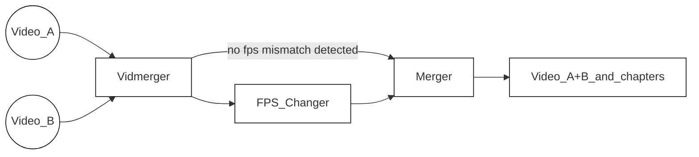

<!-- https://github.com/elsewhencode/project-guidelines/blob/master/README.sample.md -->

<p align="center"><a></a></p>

<h1 align="center">Vidmerger</h1>
<p align="center">Un envoltorio alrededor de FFmpeg que simplifica la fusión de múltiples videos.</p>


## 🙉 ¿Qué es exactamente esto?

Vidmerger es una herramienta de línea de comandos que usa **ffmpeg** para fusionar múltiples archivos de video con la misma extensión en un solo archivo, por ejemplo, ejecutar `vidmerger .` sobre archivos mp4 crearía un video fusionado llamado `output.mp4` 🐣

Aquí está la ayuda de uso de vidmerger 🤗

```shell
A wrapper around ffmpeg which simplifies merging multiple videos 🎞  Everything in between the first `-` till the fill extension of the input files will be used as chapter titles 📖.

Usage: vidmerger [OPTIONS] <TARGET_DIR>

Arguments:
  <TARGET_DIR>  Sets the input file to use

Options:
  -f, --format <format>   Specifies which formats should be merged individually, the default is 👉 3g2,3gp,aac,ac3,alac,amr,ape,au,avi,awb,dts,f4a,f4b,f4p,f4v,flac,flv,m4a,m4b,m4p,m4r,m4v,mkv,mov,mp2,mp3,mp4,mpeg,mpg,oga,ogg,ogm,ogv,ogx,opus,pcm,spx,wav,webm,wma,wmv
      --fps <fps>         Generates videos inside a temporary folder with this fps value and merges them
      --shutdown          For doing a shutdown at the end (needs sudo)
      --skip-fps-changer  Skips the fps changer
  -y, --yes               Skips confirmation of merge order
      --verbose           Prints detailed logs
  -h, --help              Print help
  -V, --version           Print version
```



| Feature     | Description                                                                                                                                                                                                                                     |
| :---------- | ----------------------------------------------------------------------------------------------------------------------------------------------------------------------------------------------------------------------------------------------- |
| Selector    | Itera a través de [esta lista de extensiones de archivo](https://raw.githubusercontent.com/tgotwig/vidmerger/main/src/main.rs#L34), selecciona todos los archivos que coinciden con la extensión actual excepto los que comienzan con un punto. La lista puede ser sobrescrita con `--format` o `-f`, ejemplo: `--format mp4,mkv`. |
| FPS_Changer | Después de detectar valores de fps que no coinciden, escala todos los videos con fps más altos al valor más bajo detectado. Puede omitirse con `--skip-fps-changer`. El valor deseado de fps puede establecerse con `--fps`, ejemplo: `--fps 23.976`.              |
| Merger      | Finalmente, une los videos y añade capítulos. Los títulos de los capítulos se extraen automáticamente de los nombres de archivo de entrada — específicamente, el texto entre el primer guion y la extensión del archivo. Ejemplo: `Video_A - Chapter 1.mp4`. |

## ✨ Instalación / Primeros pasos

Puedes instalarlo en los tres principales sistemas operativos 🤗

### X64

| Plataforma | Gestor                                                                                     | Comando                                                                                                                                                                                          |
| :--------- | :----------------------------------------------------------------------------------------- | :----------------------------------------------------------------------------------------------------------------------------------------------------------------------------------------------- |
| 🍎 MacOS   | 🍺 [Homebrew](https://github.com/TGotwig/homebrew-vidmerger/blob/master/vidmerger.rb)       | brew tap tgotwig/vidmerger<br>brew install vidmerger                                                                                                                                             |
| 🐧 Linux   | 🍺 [Homebrew](https://github.com/TGotwig/homebrew-linux-vidmerger/blob/master/vidmerger.rb) | brew tap tgotwig/linux-vidmerger<br>brew install vidmerger                                                                                                                                       |
| 🐧 Linux   | 🍺 CURL                                                                                     | sudo curl -L https://github.com/TGotwig/vidmerger/releases/latest/download/vidmerger-linux.tar.gz -o /tmp/vidmerger-linux.tar.gz && sudo tar -xzvf /tmp/vidmerger-linux.tar.gz -C /usr/local/bin |
| 🏳️‍🌈 Windows | 🍫 [Chocolatey](https://community.chocolatey.org/packages/vidmerger)                        | choco install ffmpeg # prerequisito<br>choco install vidmerger                                                                                                                                   |

### ARM64

| Plataforma | Gestor                                                                                 | Comando                                                                                                                                                                                                           |
| :--------- | :------------------------------------------------------------------------------------- | :---------------------------------------------------------------------------------------------------------------------------------------------------------------------------------------------------------------- |
| 🍎 MacOS   | 🍺 [Homebrew](https://github.com/TGotwig/homebrew-vidmerger/blob/master/vidmerger.rb)   | brew tap tgotwig/vidmerger<br>brew install vidmerger                                                                                                                                                              |
| 🐧 Linux   | 🍺 CURL                                                                               | sudo curl -L https://github.com/tgotwig/vidmerger/releases/download/0.4.0/vidmerger-linux-arm64.tar.gz -o /tmp/vidmerger-linux-arm64.tar.gz && sudo tar -xzvf /tmp/vidmerger-linux-arm64.tar.gz -C /usr/local/bin |

### Docker (X64 & ARM64)

También puedes usar Docker para ejecutar vidmerger sin instalar nada más que Docker, alojado en [Dockerhub](https://hub.docker.com/r/tgotwig/vidmerger) 🐳


```bash
docker container run -it -v <PATH-TO-YOUR-VIDEOS>:/data tgotwig/vidmerger
```

Ejemplos con Bash:

```bash
docker container run tgotwig/vidmerger --help
docker container run tgotwig/vidmerger --version
docker container run -it -v ./data/call_merger:/data tgotwig/vidmerger
```

## ⚙️ Desarrollo

Los requisitos principales son rust, ffmpeg y go-task. El devcontainer proporciona todos los componentes necesarios 🔧

Si ves algo que mejorar, solo crea un [issue](https://github.com/tgotwig/vidmerger/issues) o abre directamente un [pull request](https://github.com/tgotwig/vidmerger/pulls) 🤗✨

### Despliegue / Publicación

Para detalles sobre cómo publicar una nueva versión, puedes consultar la página wiki [Publicar nueva versión](https://github.com/tgotwig/vidmerger/wiki#-publish-new-version) 📖

## 🧪 Pruebas

- Para pruebas principales: `task test`
- Para pruebas de linting: `task lint`

## 🌟 Guía de estilo

- [rust-clippy](rust-clippy)
- [rls-vscode](https://github.com/rust-lang/rls-vscode)



---


Tranlated By [Open Ai Tx](https://github.com/OpenAiTx/OpenAiTx) | Last indexed: 2026-01-04


---