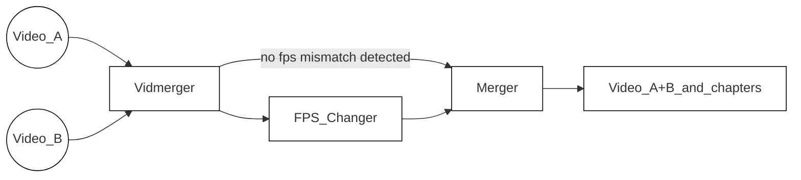

<!-- https://github.com/elsewhencode/project-guidelines/blob/master/README.sample.md -->

<p align="center"><a></a></p>

<h1 align="center">Vidmerger</h1>
<p align="center">Une interface autour de FFmpeg qui simplifie la fusion de plusieurs vidéos.</p>


## 🙉 Qu'est-ce que c'est exactement ?

Vidmerger est un outil en ligne de commande qui utilise **ffmpeg** pour fusionner plusieurs fichiers vidéo avec la même extension en un seul fichier, par exemple lancer `vidmerger .` sur des fichiers mp4 créerait une vidéo fusionnée appelée `output.mp4` 🐣

Voici l'aide à l'utilisation de vidmerger 🤗

```shell
A wrapper around ffmpeg which simplifies merging multiple videos 🎞  Everything in between the first `-` till the fill extension of the input files will be used as chapter titles 📖.

Usage: vidmerger [OPTIONS] <TARGET_DIR>

Arguments:
  <TARGET_DIR>  Sets the input file to use

Options:
  -f, --format <format>   Specifies which formats should be merged individually, the default is 👉 3g2,3gp,aac,ac3,alac,amr,ape,au,avi,awb,dts,f4a,f4b,f4p,f4v,flac,flv,m4a,m4b,m4p,m4r,m4v,mkv,mov,mp2,mp3,mp4,mpeg,mpg,oga,ogg,ogm,ogv,ogx,opus,pcm,spx,wav,webm,wma,wmv
      --fps <fps>         Generates videos inside a temporary folder with this fps value and merges them
      --shutdown          For doing a shutdown at the end (needs sudo)
      --skip-fps-changer  Skips the fps changer
  -y, --yes               Skips confirmation of merge order
      --verbose           Prints detailed logs
  -h, --help              Print help
  -V, --version           Print version
```



| Fonctionnalité | Description                                                                                                                                                                                                                                  |
| :------------- | -------------------------------------------------------------------------------------------------------------------------------------------------------------------------------------------------------------------------------------------- |
| Sélecteur      | Parcourt [cette liste d’extensions de fichiers](https://raw.githubusercontent.com/tgotwig/vidmerger/main/src/main.rs#L34), sélectionne tous les fichiers correspondant à l’extension actuelle sauf ceux commençant par un point. La liste peut être remplacée par `--format` ou `-f`, exemple : `--format mp4,mkv`. |
| Changeur_FPS   | Après avoir détecté des valeurs de fps non correspondantes, il réduit tous les fichiers vidéo avec un fps plus élevé au fps le plus bas détecté. Peut être ignoré avec `--skip-fps-changer`. La valeur de fps désirée peut être définie avec `--fps`, exemple : `--fps 23.976`.           |
| Fusionneur     | Enfin, il fusionne les vidéos et ajoute des chapitres. Les titres des chapitres sont automatiquement extraits des noms de fichiers d’entrée — précisément, le texte entre le premier tiret et l’extension du fichier. Exemple : `Video_A - Chapter 1.mp4`.                             |

## ✨ Installation / Prise en main

Vous pouvez l’installer sur les trois principaux systèmes d’exploitation 🤗

### X64

| Plateforme | Gestionnaire                                                                              | Commande                                                                                                                                                                                         |
| :--------- | :--------------------------------------------------------------------------------------- | :----------------------------------------------------------------------------------------------------------------------------------------------------------------------------------------------- |
| 🍎 MacOS   | 🍺 [Homebrew](https://github.com/TGotwig/homebrew-vidmerger/blob/master/vidmerger.rb)     | brew tap tgotwig/vidmerger<br>brew install vidmerger                                                                                                                                             |
| 🐧 Linux   | 🍺 [Homebrew](https://github.com/TGotwig/homebrew-linux-vidmerger/blob/master/vidmerger.rb) | brew tap tgotwig/linux-vidmerger<br>brew install vidmerger                                                                                                                                       |
| 🐧 Linux   | 🍺 CURL                                                                                   | sudo curl -L https://github.com/TGotwig/vidmerger/releases/latest/download/vidmerger-linux.tar.gz -o /tmp/vidmerger-linux.tar.gz && sudo tar -xzvf /tmp/vidmerger-linux.tar.gz -C /usr/local/bin |
| 🏳️‍🌈 Windows | 🍫 [Chocolatey](https://community.chocolatey.org/packages/vidmerger)                      | choco install ffmpeg # prérequis<br>choco install vidmerger                                                                                                                                      |

### ARM64

| Plateforme | Gestionnaire                                                                            | Commande                                                                                                                                                                                                       |
| :--------- | :------------------------------------------------------------------------------------- | :-------------------------------------------------------------------------------------------------------------------------------------------------------------------------------------------------------------- |
| 🍎 MacOS   | 🍺 [Homebrew](https://github.com/TGotwig/homebrew-vidmerger/blob/master/vidmerger.rb)   | brew tap tgotwig/vidmerger<br>brew install vidmerger                                                                                                                                                          |
| 🐧 Linux   | 🍺 CURL                                                                                 | sudo curl -L https://github.com/tgotwig/vidmerger/releases/download/0.4.0/vidmerger-linux-arm64.tar.gz -o /tmp/vidmerger-linux-arm64.tar.gz && sudo tar -xzvf /tmp/vidmerger-linux-arm64.tar.gz -C /usr/local/bin |

### Docker (X64 & ARM64)

Vous pouvez aussi utiliser Docker pour exécuter vidmerger sans rien installer à part Docker, hébergé sur [Dockerhub](https://hub.docker.com/r/tgotwig/vidmerger) 🐳


```bash
docker container run -it -v <PATH-TO-YOUR-VIDEOS>:/data tgotwig/vidmerger
```

Exemples avec Bash :

```bash
docker container run tgotwig/vidmerger --help
docker container run tgotwig/vidmerger --version
docker container run -it -v ./data/call_merger:/data tgotwig/vidmerger
```

## ⚙️ Développement

Les exigences principales sont rust, ffmpeg et go-task. Le devcontainer fournit tous les composants nécessaires 🔧

Si vous voyez quelque chose à améliorer, créez simplement un [issue](https://github.com/tgotwig/vidmerger/issues) ou ouvrez directement une [pull request](https://github.com/tgotwig/vidmerger/pulls) 🤗✨

### Déploiement / Publication

Pour les détails sur la façon de publier une nouvelle version, vous pouvez consulter la page wiki [Publier une nouvelle version](https://github.com/tgotwig/vidmerger/wiki#-publish-new-version) 📖

## 🧪 Tests

- Pour les tests majeurs : `task test`
- Pour les tests de linting : `task lint`

## 🌟 Guide de style

- [rust-clippy](rust-clippy)
- [rls-vscode](https://github.com/rust-lang/rls-vscode)



---


Tranlated By [Open Ai Tx](https://github.com/OpenAiTx/OpenAiTx) | Last indexed: 2026-01-04


---