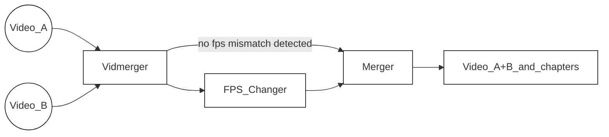

<!-- https://github.com/elsewhencode/project-guidelines/blob/master/README.sample.md -->

<p align="center"><a></a></p>

<h1 align="center">Vidmerger</h1>
<p align="center">複数の動画を簡単に結合するためのFFmpegラッパーです。</p>


## 🙉 これは正確には何ですか？

Vidmergerはコマンドラインツールで、**ffmpeg** を使用して同じファイル拡張子の複数の動画ファイルを1つのファイルに結合します。例えば、mp4ファイルに対して `vidmerger .` を実行すると、`output.mp4` という結合された動画が作成されます🐣

以下はvidmergerの使用方法ヘルプです🤗

```shell
A wrapper around ffmpeg which simplifies merging multiple videos 🎞  Everything in between the first `-` till the fill extension of the input files will be used as chapter titles 📖.

Usage: vidmerger [OPTIONS] <TARGET_DIR>

Arguments:
  <TARGET_DIR>  Sets the input file to use

Options:
  -f, --format <format>   Specifies which formats should be merged individually, the default is 👉 3g2,3gp,aac,ac3,alac,amr,ape,au,avi,awb,dts,f4a,f4b,f4p,f4v,flac,flv,m4a,m4b,m4p,m4r,m4v,mkv,mov,mp2,mp3,mp4,mpeg,mpg,oga,ogg,ogm,ogv,ogx,opus,pcm,spx,wav,webm,wma,wmv
      --fps <fps>         Generates videos inside a temporary folder with this fps value and merges them
      --shutdown          For doing a shutdown at the end (needs sudo)
      --skip-fps-changer  Skips the fps changer
  -y, --yes               Skips confirmation of merge order
      --verbose           Prints detailed logs
  -h, --help              Print help
  -V, --version           Print version
```



| Feature     | Description                                                                                                                                                                                                                                     |
| :---------- | ----------------------------------------------------------------------------------------------------------------------------------------------------------------------------------------------------------------------------------------------- |
| Selector    | [このファイル拡張子のリスト](https://raw.githubusercontent.com/tgotwig/vidmerger/main/src/main.rs#L34) を順に処理し、現在のファイル拡張子に一致するファイルを選択します。ただし、ドットで始まるものは除きます。リストは `--format` または `-f` で上書き可能です。例：`--format mp4,mkv`。 |
| FPS_Changer | fps値が一致しない場合、検出された中で最も低いfps値に合わせて全ての高fps動画をスケールダウンします。`--skip-fps-changer` でスキップ可能です。希望のfps値は `--fps` で設定できます。例：`--fps 23.976`。              |
| Merger      | 最後に動画をマージし、チャプターを追加します。チャプタータイトルは入力ファイル名から自動抽出されます。具体的には、最初のダッシュと拡張子の間のテキストです。例：`Video_A - Chapter 1.mp4`。                                         |

## ✨ インストール / はじめに

主要な3つのOSすべてにインストール可能です 🤗

### X64

| Platform  | Packager                                                                                   | Command                                                                                                                                                                                          |
| :-------- | :----------------------------------------------------------------------------------------- | :----------------------------------------------------------------------------------------------------------------------------------------------------------------------------------------------- |
| 🍎 MacOS   | 🍺 [Homebrew](https://github.com/TGotwig/homebrew-vidmerger/blob/master/vidmerger.rb)       | brew tap tgotwig/vidmerger<br>brew install vidmerger                                                                                                                                             |
| 🐧 Linux   | 🍺 [Homebrew](https://github.com/TGotwig/homebrew-linux-vidmerger/blob/master/vidmerger.rb) | brew tap tgotwig/linux-vidmerger<br>brew install vidmerger                                                                                                                                       |
| 🐧 Linux   | 🍺 CURL                                                                                     | sudo curl -L https://github.com/TGotwig/vidmerger/releases/latest/download/vidmerger-linux.tar.gz -o /tmp/vidmerger-linux.tar.gz && sudo tar -xzvf /tmp/vidmerger-linux.tar.gz -C /usr/local/bin |
| 🏳️‍🌈 Windows | 🍫 [Chocolatey](https://community.chocolatey.org/packages/vidmerger)                        | choco install ffmpeg # prerequisite<br>choco install vidmerger                                                                                                                                   |

### ARM64

| Platform | Packager                                                                             | Command                                                                                                                                                                                                           |
| :------- | :----------------------------------------------------------------------------------- | :---------------------------------------------------------------------------------------------------------------------------------------------------------------------------------------------------------------- |
| 🍎 MacOS  | 🍺 [Homebrew](https://github.com/TGotwig/homebrew-vidmerger/blob/master/vidmerger.rb) | brew tap tgotwig/vidmerger<br>brew install vidmerger                                                                                                                                                              |
| 🐧 Linux  | 🍺 CURL                                                                               | sudo curl -L https://github.com/tgotwig/vidmerger/releases/download/0.4.0/vidmerger-linux-arm64.tar.gz -o /tmp/vidmerger-linux-arm64.tar.gz && sudo tar -xzvf /tmp/vidmerger-linux-arm64.tar.gz -C /usr/local/bin |

### Docker (X64 & ARM64)

Dockerを使えばDockerだけをインストールして、vidmergerを実行できます。[Dockerhub](https://hub.docker.com/r/tgotwig/vidmerger)にホストされています 🐳


```bash
docker container run -it -v <PATH-TO-YOUR-VIDEOS>:/data tgotwig/vidmerger
```

Bashの例：

```bash
docker container run tgotwig/vidmerger --help
docker container run tgotwig/vidmerger --version
docker container run -it -v ./data/call_merger:/data tgotwig/vidmerger
```

## ⚙️ 開発

主な要件は rust、ffmpeg、および go-task です。devcontainer が必要なすべてのコンポーネントを提供します 🔧

改善点があれば、[issue](https://github.com/tgotwig/vidmerger/issues) を作成するか、直接 [pull request](https://github.com/tgotwig/vidmerger/pulls) を開いてください 🤗✨

### デプロイ / 公開

新しいバージョンの公開方法の詳細は、[Publish new version](https://github.com/tgotwig/vidmerger/wiki#-publish-new-version) の wiki ページをご覧ください 📖

## 🧪 テスト

- 主要なテスト：`task test`
- リントテスト：`task lint`

## 🌟 スタイルガイド

- [rust-clippy](rust-clippy)
- [rls-vscode](https://github.com/rust-lang/rls-vscode)



---


Tranlated By [Open Ai Tx](https://github.com/OpenAiTx/OpenAiTx) | Last indexed: 2026-01-04


---