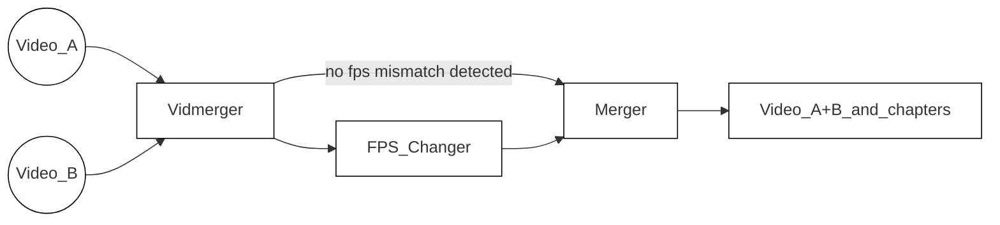

<!-- https://github.com/elsewhencode/project-guidelines/blob/master/README.sample.md -->

<p align="center"><a></a></p>

<h1 align="center">Vidmerger</h1>
<p align="center">여러 비디오를 병합하는 작업을 간소화하는 FFmpeg 래퍼입니다.</p>


## 🙉 이것은 정확히 무엇인가요?

Vidmerger는 **ffmpeg**를 사용하여 동일한 파일 확장자를 가진 여러 비디오 파일을 하나의 파일로 병합하는 명령줄 도구입니다. 예를 들어 mp4 파일에 `vidmerger .` 명령을 실행하면 `output.mp4`라는 병합된 비디오가 생성됩니다 🐣

다음은 vidmerger의 사용법 도움말입니다 🤗

```shell
A wrapper around ffmpeg which simplifies merging multiple videos 🎞  Everything in between the first `-` till the fill extension of the input files will be used as chapter titles 📖.

Usage: vidmerger [OPTIONS] <TARGET_DIR>

Arguments:
  <TARGET_DIR>  Sets the input file to use

Options:
  -f, --format <format>   Specifies which formats should be merged individually, the default is 👉 3g2,3gp,aac,ac3,alac,amr,ape,au,avi,awb,dts,f4a,f4b,f4p,f4v,flac,flv,m4a,m4b,m4p,m4r,m4v,mkv,mov,mp2,mp3,mp4,mpeg,mpg,oga,ogg,ogm,ogv,ogx,opus,pcm,spx,wav,webm,wma,wmv
      --fps <fps>         Generates videos inside a temporary folder with this fps value and merges them
      --shutdown          For doing a shutdown at the end (needs sudo)
      --skip-fps-changer  Skips the fps changer
  -y, --yes               Skips confirmation of merge order
      --verbose           Prints detailed logs
  -h, --help              Print help
  -V, --version           Print version
```



| Feature     | 설명                                                                                                                                                                                                                                         |
| :---------- | ------------------------------------------------------------------------------------------------------------------------------------------------------------------------------------------------------------------------------------------- |
| Selector    | [이 파일 확장자 목록](https://raw.githubusercontent.com/tgotwig/vidmerger/main/src/main.rs#L34)을 순회하며 현재 파일 확장자와 일치하는 모든 파일을 선택하되, 점(.)으로 시작하는 파일은 제외합니다. 이 목록은 `--format` 또는 `-f`로 덮어쓸 수 있습니다. 예: `--format mp4,mkv`. |
| FPS_Changer | 일치하지 않는 fps 값을 감지하면, 모든 더 높은 fps 영상을 가장 낮은 감지된 fps 값으로 스케일 다운합니다. `--skip-fps-changer`로 건너뛸 수 있습니다. 원하는 fps 값은 `--fps`로 설정 가능하며, 예: `--fps 23.976`.                            |
| Merger      | 마지막으로, 영상을 병합하고 챕터를 추가합니다. 챕터 제목은 입력 파일 이름에서 자동으로 추출하며, 구체적으로는 첫 번째 대시와 파일 확장자 사이의 텍스트입니다. 예: `Video_A - Chapter 1.mp4`.                                         |

## ✨ 설치 / 시작하기

세 가지 주요 운영체제 모두에 설치할 수 있습니다 🤗

### X64

| 플랫폼   | 패키저                                                                                     | 명령어                                                                                                                                                                                          |
| :-------- | :----------------------------------------------------------------------------------------- | :----------------------------------------------------------------------------------------------------------------------------------------------------------------------------------------------- |
| 🍎 MacOS   | 🍺 [Homebrew](https://github.com/TGotwig/homebrew-vidmerger/blob/master/vidmerger.rb)       | brew tap tgotwig/vidmerger<br>brew install vidmerger                                                                                                                                             |
| 🐧 Linux   | 🍺 [Homebrew](https://github.com/TGotwig/homebrew-linux-vidmerger/blob/master/vidmerger.rb) | brew tap tgotwig/linux-vidmerger<br>brew install vidmerger                                                                                                                                       |
| 🐧 Linux   | 🍺 CURL                                                                                     | sudo curl -L https://github.com/TGotwig/vidmerger/releases/latest/download/vidmerger-linux.tar.gz -o /tmp/vidmerger-linux.tar.gz && sudo tar -xzvf /tmp/vidmerger-linux.tar.gz -C /usr/local/bin |
| 🏳️‍🌈 Windows | 🍫 [Chocolatey](https://community.chocolatey.org/packages/vidmerger)                        | choco install ffmpeg # 사전 요구사항<br>choco install vidmerger                                                                                                                                   |

### ARM64

| 플랫폼 | 패키저                                                                             | 명령어                                                                                                                                                                                                           |
| :------- | :----------------------------------------------------------------------------------- | :---------------------------------------------------------------------------------------------------------------------------------------------------------------------------------------------------------------- |
| 🍎 MacOS  | 🍺 [Homebrew](https://github.com/TGotwig/homebrew-vidmerger/blob/master/vidmerger.rb) | brew tap tgotwig/vidmerger<br>brew install vidmerger                                                                                                                                                              |
| 🐧 Linux  | 🍺 CURL                                                                               | sudo curl -L https://github.com/tgotwig/vidmerger/releases/download/0.4.0/vidmerger-linux-arm64.tar.gz -o /tmp/vidmerger-linux-arm64.tar.gz && sudo tar -xzvf /tmp/vidmerger-linux-arm64.tar.gz -C /usr/local/bin |

### Docker (X64 & ARM64)

Docker만 설치되어 있으면 별도 설치 없이도 vidmerger를 실행할 수 있으며, [Dockerhub](https://hub.docker.com/r/tgotwig/vidmerger)에 호스팅되어 있습니다 🐳


```bash
docker container run -it -v <PATH-TO-YOUR-VIDEOS>:/data tgotwig/vidmerger
```

Bash 예제:

```bash
docker container run tgotwig/vidmerger --help
docker container run tgotwig/vidmerger --version
docker container run -it -v ./data/call_merger:/data tgotwig/vidmerger
```
## ⚙️ 개발

주요 요구 사항은 rust, ffmpeg, 그리고 go-task입니다. devcontainer가 모든 필요한 구성 요소를 제공합니다 🔧

개선할 점이 보이면, [이슈](https://github.com/tgotwig/vidmerger/issues)를 생성하거나 직접 [풀 리퀘스트](https://github.com/tgotwig/vidmerger/pulls)를 열어주세요 🤗✨

### 배포 / 발행

새 버전을 발행하는 방법에 대한 자세한 내용은 [새 버전 발행](https://github.com/tgotwig/vidmerger/wiki#-publish-new-version) 위키 페이지를 참고하세요 📖

## 🧪 테스트

- 주요 테스트: `task test`
- 린팅 테스트: `task lint`

## 🌟 스타일 가이드

- [rust-clippy](rust-clippy)
- [rls-vscode](https://github.com/rust-lang/rls-vscode)



---


Tranlated By [Open Ai Tx](https://github.com/OpenAiTx/OpenAiTx) | Last indexed: 2026-01-04


---