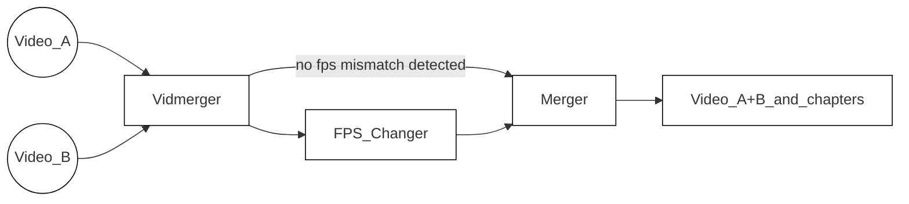

<!-- https://github.com/elsewhencode/project-guidelines/blob/master/README.sample.md -->

<p align="center"><a></a></p>

<h1 align="center">Vidmerger</h1>
<p align="center">一个基于 FFmpeg 的封装工具，简化多个视频合并的操作。</p>


## 🙉 这到底是什么？

Vidmerger 是一个命令行工具，使用 **ffmpeg** 将多个具有相同文件扩展名的视频文件合并为一个文件，例如对 mp4 文件运行 `vidmerger .` 会创建一个名为 `output.mp4` 的合并视频 🐣

以下是 vidmerger 的使用帮助 🤗

```shell
A wrapper around ffmpeg which simplifies merging multiple videos 🎞  Everything in between the first `-` till the fill extension of the input files will be used as chapter titles 📖.

Usage: vidmerger [OPTIONS] <TARGET_DIR>

Arguments:
  <TARGET_DIR>  Sets the input file to use

Options:
  -f, --format <format>   Specifies which formats should be merged individually, the default is 👉 3g2,3gp,aac,ac3,alac,amr,ape,au,avi,awb,dts,f4a,f4b,f4p,f4v,flac,flv,m4a,m4b,m4p,m4r,m4v,mkv,mov,mp2,mp3,mp4,mpeg,mpg,oga,ogg,ogm,ogv,ogx,opus,pcm,spx,wav,webm,wma,wmv
      --fps <fps>         Generates videos inside a temporary folder with this fps value and merges them
      --shutdown          For doing a shutdown at the end (needs sudo)
      --skip-fps-changer  Skips the fps changer
  -y, --yes               Skips confirmation of merge order
      --verbose           Prints detailed logs
  -h, --help              Print help
  -V, --version           Print version
```



| Feature     | Description                                                                                                                                                                                                                                     |
| :---------- | ----------------------------------------------------------------------------------------------------------------------------------------------------------------------------------------------------------------------------------------------- |
| Selector    | 迭代遍历[此文件后缀列表](https://raw.githubusercontent.com/tgotwig/vidmerger/main/src/main.rs#L34)，选择所有与当前文件后缀匹配的文件，但排除以点开头的文件。该列表可通过 `--format` 或 `-f` 覆盖，例如：`--format mp4,mkv`。 |
| FPS_Changer | 在检测到不匹配的帧率值后，它将所有较高帧率的视频缩放至检测到的最低帧率值。可通过 `--skip-fps-changer` 跳过。期望的帧率值可通过 `--fps` 设置，例如：`--fps 23.976`。              |
| Merger      | 最后，它合并视频并添加章节。章节标题自动从输入文件名提取——具体为第一个连字符和文件扩展名之间的文本。例如：`Video_A - Chapter 1.mp4`。                                                            |

## ✨ 安装 / 入门

您可以在三大主流操作系统上安装它 🤗

### X64

| Platform  | Packager                                                                                   | Command                                                                                                                                                                                          |
| :-------- | :----------------------------------------------------------------------------------------- | :----------------------------------------------------------------------------------------------------------------------------------------------------------------------------------------------- |
| 🍎 MacOS   | 🍺 [Homebrew](https://github.com/TGotwig/homebrew-vidmerger/blob/master/vidmerger.rb)       | brew tap tgotwig/vidmerger<br>brew install vidmerger                                                                                                                                             |
| 🐧 Linux   | 🍺 [Homebrew](https://github.com/TGotwig/homebrew-linux-vidmerger/blob/master/vidmerger.rb) | brew tap tgotwig/linux-vidmerger<br>brew install vidmerger                                                                                                                                       |
| 🐧 Linux   | 🍺 CURL                                                                                     | sudo curl -L https://github.com/TGotwig/vidmerger/releases/latest/download/vidmerger-linux.tar.gz -o /tmp/vidmerger-linux.tar.gz && sudo tar -xzvf /tmp/vidmerger-linux.tar.gz -C /usr/local/bin |
| 🏳️‍🌈 Windows | 🍫 [Chocolatey](https://community.chocolatey.org/packages/vidmerger)                        | choco install ffmpeg # 先决条件<br>choco install vidmerger                                                                                                                                       |

### ARM64

| Platform | Packager                                                                             | Command                                                                                                                                                                                                           |
| :------- | :----------------------------------------------------------------------------------- | :---------------------------------------------------------------------------------------------------------------------------------------------------------------------------------------------------------------- |
| 🍎 MacOS  | 🍺 [Homebrew](https://github.com/TGotwig/homebrew-vidmerger/blob/master/vidmerger.rb) | brew tap tgotwig/vidmerger<br>brew install vidmerger                                                                                                                                                              |
| 🐧 Linux  | 🍺 CURL                                                                               | sudo curl -L https://github.com/tgotwig/vidmerger/releases/download/0.4.0/vidmerger-linux-arm64.tar.gz -o /tmp/vidmerger-linux-arm64.tar.gz && sudo tar -xzvf /tmp/vidmerger-linux-arm64.tar.gz -C /usr/local/bin |

### Docker (X64 & ARM64)

您也可以使用 Docker 来运行 vidmerger，无需安装除 Docker 之外的任何东西，镜像托管于 [Dockerhub](https://hub.docker.com/r/tgotwig/vidmerger) 🐳


```bash
docker container run -it -v <PATH-TO-YOUR-VIDEOS>:/data tgotwig/vidmerger
```

Bash 示例：

```bash
docker container run tgotwig/vidmerger --help
docker container run tgotwig/vidmerger --version
docker container run -it -v ./data/call_merger:/data tgotwig/vidmerger
```

## ⚙️ 开发

主要需求是 rust、ffmpeg 和 go-task。devcontainer 提供了所有必要组件 🔧

如果你发现任何可以改进的地方，欢迎创建一个 [issue](https://github.com/tgotwig/vidmerger/issues) 或直接提交一个 [pull request](https://github.com/tgotwig/vidmerger/pulls) 🤗✨

### 部署 / 发布

有关如何发布新版本的详细信息，可以查看 [发布新版本](https://github.com/tgotwig/vidmerger/wiki#-publish-new-version) 维基页面 📖

## 🧪 测试

- 主要测试：`task test`
- 代码检查测试：`task lint`

## 🌟 代码风格指南

- [rust-clippy](rust-clippy)
- [rls-vscode](https://github.com/rust-lang/rls-vscode)



---


Tranlated By [Open Ai Tx](https://github.com/OpenAiTx/OpenAiTx) | Last indexed: 2026-01-04


---