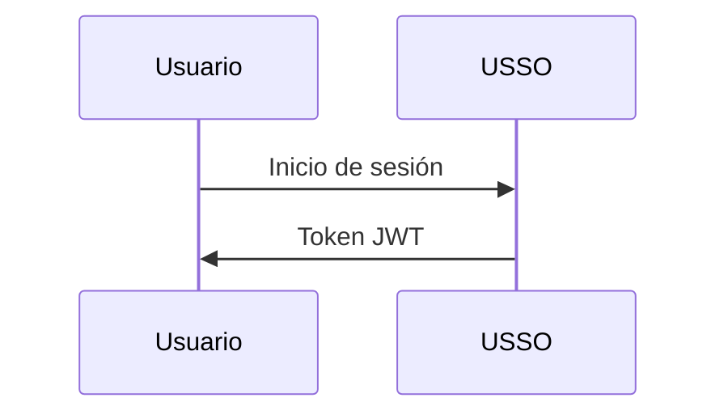

# Documentación de USSO

Documentación oficial de [USSO](https://github.com/ussoio/usso) - Una plataforma SSO segura y multiinquilino.

## 📖 Acerca de

Este repositorio contiene la documentación completa de USSO, construida con [MkDocs](https://www.mkdocs.org/) y [Material for MkDocs](https://squidfunk.github.io/mkdocs-material/).

**Documentación en Vivo**: [docs.usso.io](https://docs.usso.io) (próximamente)

## 🚀 Inicio Rápido

### Requisitos Previos

- Python 3.10+
- pip

### Desarrollo Local

1. **Clona el repositorio**

   ```bash
   git clone https://github.com/ussoio/usso-docs.git
   cd usso-docs
   ```

2. **Instalar dependencias**

   ```bash
   pip install -r requirements.txt
   ```

3. **Inicie el servidor de desarrollo**

   ```bash
   mkdocs serve
   ```
4. **Abre tu navegador**

   Visita [http://localhost:8000](http://localhost:8000)

## 📁 Estructura


```
docs/
├── index.md                    # Homepage
├── getting-started/            # Getting started guides
│   ├── overview.md
│   ├── quickstart.md
│   ├── installation.md
│   └── first-steps.md
├── concepts/                   # Core concepts
│   ├── architecture.md
│   ├── multi-tenancy.md
│   ├── auth-vs-authz.md
│   └── tokens-sessions.md
├── authentication/             # Authentication guides
│   ├── overview.md
│   ├── login-methods.md
│   ├── password.md
│   ├── magic-link.md
│   ├── otp.md
│   ├── oauth.md
│   ├── passkeys.md
│   └── qr-login.md
├── authorization/              # Authorization guides
│   ├── overview.md
│   ├── roles-permissions.md
│   ├── scopes.md
│   ├── workspace-access.md
│   └── custom-policies.md
├── user-management/            # User management
│   ├── users.md
│   ├── profiles.md
│   ├── sessions.md
│   ├── credentials.md
│   └── referrals.md
├── service-accounts/           # Service accounts
│   ├── overview.md
│   ├── creating-agents.md
│   ├── api-keys.md
│   └── best-practices.md
├── oauth-provider/             # OAuth provider
│   ├── overview.md
│   ├── setup.md
│   ├── clients.md
│   ├── flows.md
│   └── introspection.md
├── tenant/                     # Tenant management
│   ├── overview.md
│   ├── configuration.md
│   ├── domains.md
│   ├── branding.md
│   ├── messaging.md
│   └── keys.md
├── integration/                # Integration guides
│   ├── python-sdk.md
│   ├── javascript-sdk.md
│   ├── rest-api.md
│   └── webhooks.md
├── security/                   # Security guides
│   ├── best-practices.md
│   ├── captcha.md
│   ├── rate-limiting.md
│   └── token-security.md
├── deployment/                 # Deployment guides
│   ├── docker.md
│   ├── environment.md
│   ├── production.md
│   └── monitoring.md
├── api/                        # API reference
│   ├── authentication.md
│   ├── users.md
│   ├── tenants.md
│   └── oauth.md
├── roadmap.md                  # Product roadmap
├── faq.md                      # FAQ
└── contributing.md             # Contributing guide
```

## 🤝 Contribuyendo

¡Damos la bienvenida a las contribuciones para mejorar la documentación!

### Cómo Contribuir

1. **Haz un fork del repositorio**

2. **Crea una rama de características**

   ```bash
   git checkout -b docs/improve-authentication-guide
   ```

3. **Realiza tus cambios**

   - Edita los archivos Markdown en el directorio `docs/`
   - Sigue nuestra [guía de estilo de escritura](#writing-style-guide)
   - Prueba localmente con `mkdocs serve`

4. **Confirma tus cambios**

   ```bash
   git commit -m "docs: improve authentication guide"
   ```

5. **Envía a tu fork**

   ```bash
   git push origin docs/improve-authentication-guide
   ```

6. **Abrir una Pull Request**

### Qué Contribuir

- 🐛 **Corregir errores tipográficos y fallos**
- 📝 **Mejorar las explicaciones**
- 💡 **Agregar ejemplos**
- 🌍 **Traducir a otros idiomas**
- 📸 **Agregar diagramas y capturas de pantalla**
- ✨ **Escribir nuevas guías**

## ✍️ Guía de Estilo para Escribir

### Directrices Generales

- Usar **lenguaje claro y sencillo**
- Escribir para **principiantes** - explicar términos técnicos
- Incluir **ejemplos prácticos**
- Añadir **muestras de código** en varios lenguajes (Python, JavaScript, cURL)
- Usar **diagramas** cuando sean útiles (Mermaid)

### Ejemplos de Código

Siempre proporcionar ejemplos en al menos 3 formatos:

````markdown
=== "Python"

    ```python
    import requests
    
    respuesta = requests.post(...)
    ```

=== "JavaScript"

    ```javascript
    const response = await fetch(...)
    ```

=== "cURL"

    ```bash
    curl -X POST ...
    ```
````

### Convenciones de Markdown

- Use `#` para el título de la página (h1) - solo una vez por página
- Use `##` para secciones principales (h2)
- Use `###` para subsecciones (h3)
- Use bloques de código con lenguaje: \`\`\`python
- Use admoniciones para notas/advertencias:

  ```markdown
  !!! tip "Pro Tip"
      This is a helpful tip
  
  !!! warning "Important"
      Pay attention to this
  ```

### Diagramas

Usa [Mermaid](https://mermaid.js.org/) para diagramas:


````.

## 🔧 Construcción de Documentación

### Compilar para Producción

```bash
mkdocs build
```

Esto crea un directorio `site/` con archivos HTML estáticos.

### Desplegar en GitHub Pages

```bash
mkdocs gh-deploy
```

## 📦 Dependencias

Dependencias clave (ver `requirements.txt`):

- **mkdocs** - Generador de documentación
- **mkdocs-material** - Tema Material
- **pymdown-extensions** - Extensiones de Markdown
- **mkdocstrings** - Documentación API desde código

## 🔍 Búsqueda

La documentación incluye búsqueda de texto completo impulsada por el plugin de búsqueda de MkDocs.

## 🌐 Internacionalización

Planeamos soportar múltiples idiomas. ¿Interesado en traducir? [Abre un issue](https://github.com/ussoio/usso-docs/issues)!

## 📄 Licencia

Esta documentación está licenciada bajo la [Licencia Internacional Creative Commons Attribution 4.0](LICENSE).

El software USSO en sí está licenciado bajo la [Licencia Apache 2.0](https://github.com/ussoio/usso/blob/main/LICENSE).

## 🔗 Enlaces

- **Repositorio principal**: [github.com/ussoio/usso](https://github.com/ussoio/usso)
- **Documentación**: [docs.usso.io](https://docs.usso.io)
- **Sitio web**: [usso.io](https://usso.io)
- **Issues**: [github.com/ussoio/usso/issues](https://github.com/ussoio/usso/issues)
- **Discusiones**: [github.com/ussoio/usso/discussions](https://github.com/ussoio/usso/discussions)

## 💬 Soporte

- **Problemas con la documentación**: [Abre un issue](https://github.com/ussoio/usso-docs/issues)
- **Problemas con el producto**: [Abre en el repositorio principal](https://github.com/ussoio/usso/issues)
- **Preguntas**: [GitHub Discussions](https://github.com/ussoio/usso/discussions)
- **Correo electrónico**: support@usso.io

## 🙏 Agradecimientos
Construido con:

- [MkDocs](https://www.mkdocs.org/)
- [Material for MkDocs](https://squidfunk.github.io/mkdocs-material/)
- [Mermaid](https://mermaid.js.org/)

---

**Hecho con ❤️ por el equipo de USSO**



---


Tranlated By [Open Ai Tx](https://github.com/OpenAiTx/OpenAiTx) | Last indexed: 2025-10-10


---