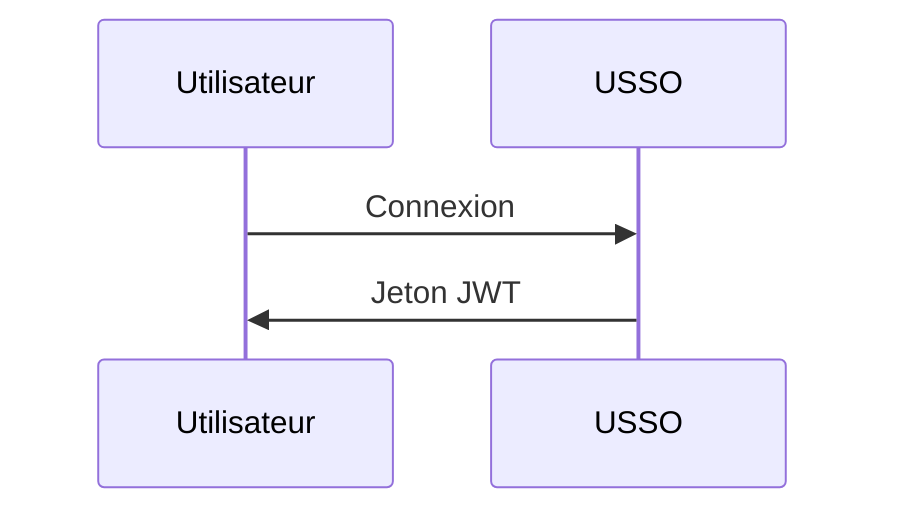

# Documentation USSO

Documentation officielle pour [USSO](https://github.com/ussoio/usso) - Une plateforme SSO sécurisée et multi-locataires.

## 📖 À propos

Ce dépôt contient la documentation complète pour USSO, construite avec [MkDocs](https://www.mkdocs.org/) et [Material for MkDocs](https://squidfunk.github.io/mkdocs-material/).

**Documentation en ligne** : [docs.usso.io](https://docs.usso.io) (bientôt disponible)

## 🚀 Démarrage rapide

### Prérequis

- Python 3.10+
- pip

### Développement local

1. **Cloner le dépôt**

   ```bash
   git clone https://github.com/ussoio/usso-docs.git
   cd usso-docs
   ```
2. **Installer les dépendances**


   ```bash
   pip install -r requirements.txt
   ```

3. **Démarrez le serveur de développement**

   ```bash
   mkdocs serve
   ```

4. **Ouvrez votre navigateur**

   Visitez [http://localhost:8000](http://localhost:8000)

## 📁 Structure

```
docs/
├── index.md                    # Homepage
├── getting-started/            # Getting started guides
│   ├── overview.md
│   ├── quickstart.md
│   ├── installation.md
│   └── first-steps.md
├── concepts/                   # Core concepts
│   ├── architecture.md
│   ├── multi-tenancy.md
│   ├── auth-vs-authz.md
│   └── tokens-sessions.md
├── authentication/             # Authentication guides
│   ├── overview.md
│   ├── login-methods.md
│   ├── password.md
│   ├── magic-link.md
│   ├── otp.md
│   ├── oauth.md
│   ├── passkeys.md
│   └── qr-login.md
├── authorization/              # Authorization guides
│   ├── overview.md
│   ├── roles-permissions.md
│   ├── scopes.md
│   ├── workspace-access.md
│   └── custom-policies.md
├── user-management/            # User management
│   ├── users.md
│   ├── profiles.md
│   ├── sessions.md
│   ├── credentials.md
│   └── referrals.md
├── service-accounts/           # Service accounts
│   ├── overview.md
│   ├── creating-agents.md
│   ├── api-keys.md
│   └── best-practices.md
├── oauth-provider/             # OAuth provider
│   ├── overview.md
│   ├── setup.md
│   ├── clients.md
│   ├── flows.md
│   └── introspection.md
├── tenant/                     # Tenant management
│   ├── overview.md
│   ├── configuration.md
│   ├── domains.md
│   ├── branding.md
│   ├── messaging.md
│   └── keys.md
├── integration/                # Integration guides
│   ├── python-sdk.md
│   ├── javascript-sdk.md
│   ├── rest-api.md
│   └── webhooks.md
├── security/                   # Security guides
│   ├── best-practices.md
│   ├── captcha.md
│   ├── rate-limiting.md
│   └── token-security.md
├── deployment/                 # Deployment guides
│   ├── docker.md
│   ├── environment.md
│   ├── production.md
│   └── monitoring.md
├── api/                        # API reference
│   ├── authentication.md
│   ├── users.md
│   ├── tenants.md
│   └── oauth.md
├── roadmap.md                  # Product roadmap
├── faq.md                      # FAQ
└── contributing.md             # Contributing guide
```

## 🤝 Contribution

Nous accueillons les contributions pour améliorer la documentation !

### Comment contribuer

1. **Forkez le dépôt**

2. **Créez une branche de fonctionnalité**

   ```bash
   git checkout -b docs/improve-authentication-guide
   ```

3. **Apportez vos modifications**

   - Modifiez les fichiers Markdown dans le répertoire `docs/`
   - Suivez notre [guide de style d’écriture](#writing-style-guide)
   - Testez localement avec `mkdocs serve`

4. **Validez vos modifications**

   ```bash
   git commit -m "docs: improve authentication guide"
   ```

5. **Pousser vers votre fork**

   ```bash
   git push origin docs/improve-authentication-guide
   ```

6. **Ouvrir une Pull Request**

### Ce qu'il faut contribuer

- 🐛 **Corriger les fautes de frappe et erreurs**
- 📝 **Améliorer les explications**
- 💡 **Ajouter des exemples**
- 🌍 **Traduire vers d'autres langues**
- 📸 **Ajouter des diagrammes et captures d'écran**
- ✨ **Rédiger de nouveaux guides**

## ✍️ Guide de style d'écriture

### Directives générales

- Utiliser un **langage clair et simple**
- Écrire pour des **débutants** - expliquer les termes techniques
- Inclure des **exemples pratiques**
- Ajouter des **extraits de code** en plusieurs langages (Python, JavaScript, cURL)
- Utiliser des **diagrammes** lorsque c'est utile (Mermaid)

### Exemples de code

Fournir toujours des exemples dans au moins 3 formats :

````markdown
=== "Python"

    ```python
    import requests
    
    response = requests.post(...)
    ```

=== "JavaScript"

    ```javascript
    const response = await fetch(...)
    ```

=== "cURL"

    ```bash
    curl -X POST ...
    ```
````

### Conventions Markdown

- Utilisez `#` pour le titre de la page (h1) - une seule fois par page
- Utilisez `##` pour les sections principales (h2)
- Utilisez `###` pour les sous-sections (h3)
- Utilisez des blocs de code avec la langue : \`\`\`python
- Utilisez des admonitions pour les notes/avertissements :

  ```markdown
  !!! tip "Pro Tip"
      This is a helpful tip
  
  !!! warning "Important"
      Pay attention to this
  ```

### Diagrammes

Utilisez [Mermaid](https://mermaid.js.org/) pour les diagrammes :


````.

## 🔧 Construction de la documentation

### Construction pour la production

```bash
mkdocs build
```

Cela crée un répertoire `site/` avec des fichiers HTML statiques.

### Déployer sur GitHub Pages

```bash
mkdocs gh-deploy
```

## 📦 Dépendances

Dépendances clés (voir `requirements.txt`) :

- **mkdocs** - Générateur de documentation  
- **mkdocs-material** - Thème Material  
- **pymdown-extensions** - Extensions Markdown  
- **mkdocstrings** - Documentation API à partir du code  

## 🔍 Recherche

La documentation inclut une recherche en texte intégral propulsée par le plugin de recherche MkDocs.

## 🌐 Internationalisation

Nous prévoyons de supporter plusieurs langues. Intéressé par la traduction ? [Ouvrez une issue](https://github.com/ussoio/usso-docs/issues) !

## 📄 Licence

Cette documentation est sous licence [Creative Commons Attribution 4.0 International](LICENSE).

Le logiciel USSO lui-même est sous licence [Apache 2.0](https://github.com/ussoio/usso/blob/main/LICENSE).

## 🔗 Liens

- **Dépôt principal** : [github.com/ussoio/usso](https://github.com/ussoio/usso)  
- **Documentation** : [docs.usso.io](https://docs.usso.io)  
- **Site web** : [usso.io](https://usso.io)  
- **Issues** : [github.com/ussoio/usso/issues](https://github.com/ussoio/usso/issues)  
- **Discussions** : [github.com/ussoio/usso/discussions](https://github.com/ussoio/usso/discussions)  

## 💬 Support

- **Problèmes de documentation** : [Ouvrir une issue](https://github.com/ussoio/usso-docs/issues)  
- **Problèmes produit** : [Ouvrir dans le dépôt principal](https://github.com/ussoio/usso/issues)  
- **Questions** : [Discussions GitHub](https://github.com/ussoio/usso/discussions)  
- **Email** : support@usso.io  

## 🙏 Remerciements
Construit avec :

- [MkDocs](https://www.mkdocs.org/)
- [Material for MkDocs](https://squidfunk.github.io/mkdocs-material/)
- [Mermaid](https://mermaid.js.org/)

---

**Fait avec ❤️ par l'équipe USSO**



---


Tranlated By [Open Ai Tx](https://github.com/OpenAiTx/OpenAiTx) | Last indexed: 2025-10-12


---