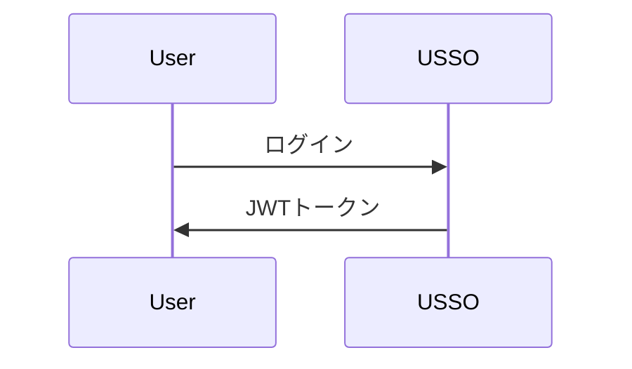

# USSO ドキュメンテーション

[USSO](https://github.com/ussoio/usso) の公式ドキュメント - セキュアでマルチテナント対応のSSOプラットフォーム。

## 📖 概要

このリポジトリには、[MkDocs](https://www.mkdocs.org/) と [Material for MkDocs](https://squidfunk.github.io/mkdocs-material/) を使って構築されたUSSOの完全なドキュメントが含まれています。

**ライブドキュメント**: [docs.usso.io](https://docs.usso.io)（近日公開予定）

## 🚀 クイックスタート

### 前提条件

- Python 3.10以上
- pip

### ローカル開発

1. **リポジトリをクローン**

   ```bash
   git clone https://github.com/ussoio/usso-docs.git
   cd usso-docs
   ```

2. **依存関係のインストール**

   ```bash
   pip install -r requirements.txt
   ```

3. **開発サーバーを起動する**

   ```bash
   mkdocs serve
   ```

4. **ブラウザを開く**

   [http://localhost:8000](http://localhost:8000) にアクセスしてください

## 📁 構造

```
docs/
├── index.md                    # Homepage
├── getting-started/            # Getting started guides
│   ├── overview.md
│   ├── quickstart.md
│   ├── installation.md
│   └── first-steps.md
├── concepts/                   # Core concepts
│   ├── architecture.md
│   ├── multi-tenancy.md
│   ├── auth-vs-authz.md
│   └── tokens-sessions.md
├── authentication/             # Authentication guides
│   ├── overview.md
│   ├── login-methods.md
│   ├── password.md
│   ├── magic-link.md
│   ├── otp.md
│   ├── oauth.md
│   ├── passkeys.md
│   └── qr-login.md
├── authorization/              # Authorization guides
│   ├── overview.md
│   ├── roles-permissions.md
│   ├── scopes.md
│   ├── workspace-access.md
│   └── custom-policies.md
├── user-management/            # User management
│   ├── users.md
│   ├── profiles.md
│   ├── sessions.md
│   ├── credentials.md
│   └── referrals.md
├── service-accounts/           # Service accounts
│   ├── overview.md
│   ├── creating-agents.md
│   ├── api-keys.md
│   └── best-practices.md
├── oauth-provider/             # OAuth provider
│   ├── overview.md
│   ├── setup.md
│   ├── clients.md
│   ├── flows.md
│   └── introspection.md
├── tenant/                     # Tenant management
│   ├── overview.md
│   ├── configuration.md
│   ├── domains.md
│   ├── branding.md
│   ├── messaging.md
│   └── keys.md
├── integration/                # Integration guides
│   ├── python-sdk.md
│   ├── javascript-sdk.md
│   ├── rest-api.md
│   └── webhooks.md
├── security/                   # Security guides
│   ├── best-practices.md
│   ├── captcha.md
│   ├── rate-limiting.md
│   └── token-security.md
├── deployment/                 # Deployment guides
│   ├── docker.md
│   ├── environment.md
│   ├── production.md
│   └── monitoring.md
├── api/                        # API reference
│   ├── authentication.md
│   ├── users.md
│   ├── tenants.md
│   └── oauth.md
├── roadmap.md                  # Product roadmap
├── faq.md                      # FAQ
└── contributing.md             # Contributing guide
```

## 🤝 貢献について

ドキュメントの改善に向けた貢献を歓迎します！

### 貢献方法

1. **リポジトリをフォークする**

2. **機能ブランチを作成する**

   ```bash
   git checkout -b docs/improve-authentication-guide
   ```

3. **変更を行う**

   - `docs/` ディレクトリ内のMarkdownファイルを編集する
   - 当社の[執筆スタイルガイド](#writing-style-guide)に従う
   - `mkdocs serve`でローカルテストを行う

4. **変更をコミットする**

   ```bash
   git commit -m "docs: improve authentication guide"
   ```

5. **あなたのフォークにプッシュする**

   ```bash
   git push origin docs/improve-authentication-guide
   ```

6. **プルリクエストを開く**

### 貢献内容

- 🐛 **誤字脱字の修正**
- 📝 **説明の改善**
- 💡 **例の追加**
- 🌍 **他言語への翻訳**
- 📸 **図やスクリーンショットの追加**
- ✨ **新しいガイドの作成**

## ✍️ 執筆スタイルガイド

### 一般的なガイドライン

- **わかりやすく簡潔な言葉**を使う
- **初心者向け**に書く - 専門用語は説明する
- **実用的な例**を含める
- **複数言語（Python、JavaScript、cURL）のコードサンプル**を追加する
- 必要に応じて**図（Mermaidなど）**を使う

### コード例

常に最低3つの形式で例を提供する：

````markdown
=== "Python"

    ```python
    import requests
    
    response = requests.post(...)
    ```

=== "JavaScript"

    ```javascript
    const response = await fetch(...)
    ```

=== "cURL"

    ```bash
    curl -X POST ...
    ```
````

### マークダウンの規則

- ページタイトル（h1）には `#` を使用 - ページごとに1回のみ
- メインセクション（h2）には `##` を使用
- サブセクション（h3）には `###` を使用
- コードフェンスには言語指定を付ける: \`\`\`python
- 注意書きや警告にはアドモニションを使用:

  ```markdown
  !!! tip "Pro Tip"
      This is a helpful tip
  
  !!! warning "Important"
      Pay attention to this
  ```

### 図表

図表には [Mermaid](https://mermaid.js.org/) を使用してください:


````.

## 🔧 ドキュメントのビルド

### 本番環境用ビルド

```bash
mkdocs build
```

これにより、静的なHTMLファイルを含む`site/`ディレクトリが作成されます。

### GitHub Pagesへのデプロイ

```bash
mkdocs gh-deploy
```
## 📦 依存関係

主要な依存関係（`requirements.txt` を参照）：

- **mkdocs** - ドキュメントジェネレーター
- **mkdocs-material** - マテリアルテーマ
- **pymdown-extensions** - Markdown 拡張
- **mkdocstrings** - コードからの API ドキュメント

## 🔍 検索

ドキュメントには MkDocs 検索プラグインによる全文検索が含まれています。

## 🌐 国際化

複数言語のサポートを予定しています。翻訳に興味がありますか？[Issueを開く](https://github.com/ussoio/usso-docs/issues)！

## 📄 ライセンス

本ドキュメントは[クリエイティブ・コモンズ 表示 4.0 国際 ライセンス](LICENSE)の下でライセンスされています。

USSO ソフトウェア自体は[Apache 2.0 ライセンス](https://github.com/ussoio/usso/blob/main/LICENSE)の下でライセンスされています。

## 🔗 リンク

- **メインリポジトリ**: [github.com/ussoio/usso](https://github.com/ussoio/usso)
- **ドキュメント**: [docs.usso.io](https://docs.usso.io)
- **ウェブサイト**: [usso.io](https://usso.io)
- **Issue**: [github.com/ussoio/usso/issues](https://github.com/ussoio/usso/issues)
- **ディスカッション**: [github.com/ussoio/usso/discussions](https://github.com/ussoio/usso/discussions)

## 💬 サポート

- **ドキュメントの問題**: [Issueを開く](https://github.com/ussoio/usso-docs/issues)
- **製品の問題**: [メインリポジトリで開く](https://github.com/ussoio/usso/issues)
- **質問**: [GitHub ディスカッション](https://github.com/ussoio/usso/discussions)
- **メール**: support@usso.io

## 🙏 謝辞


以下の技術で構築されています：

- [MkDocs](https://www.mkdocs.org/)
- [Material for MkDocs](https://squidfunk.github.io/mkdocs-material/)
- [Mermaid](https://mermaid.js.org/)

---

**USSOチームによる❤️のこもった制作**



---


Tranlated By [Open Ai Tx](https://github.com/OpenAiTx/OpenAiTx) | Last indexed: 2025-10-10


---