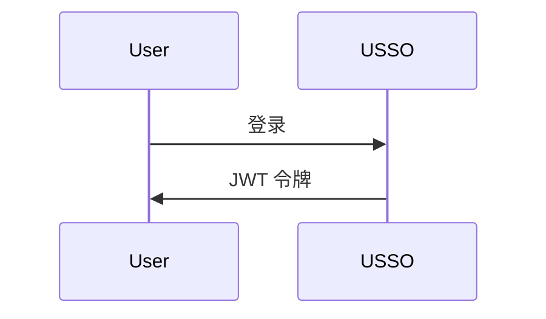

# USSO 文档

[USSO](https://github.com/ussoio/usso) 的官方文档 - 一个安全的多租户单点登录平台。

## 📖 关于

本仓库包含 USSO 的完整文档，使用 [MkDocs](https://www.mkdocs.org/) 和 [Material for MkDocs](https://squidfunk.github.io/mkdocs-material/) 构建。

**在线文档**：[docs.usso.io](https://docs.usso.io)（即将上线）

## 🚀 快速开始

### 先决条件

- Python 3.10+
- pip

### 本地开发

1. **克隆仓库**

   ```bash
   git clone https://github.com/ussoio/usso-docs.git
   cd usso-docs
   ```

2. **安装依赖项**

   ```bash
   pip install -r requirements.txt
   ```

3. **启动开发服务器**

   ```bash
   mkdocs serve
   ```

4. **打开你的浏览器**

   访问 [http://localhost:8000](http://localhost:8000)

## 📁 结构

```
docs/
├── index.md                    # Homepage
├── getting-started/            # Getting started guides
│   ├── overview.md
│   ├── quickstart.md
│   ├── installation.md
│   └── first-steps.md
├── concepts/                   # Core concepts
│   ├── architecture.md
│   ├── multi-tenancy.md
│   ├── auth-vs-authz.md
│   └── tokens-sessions.md
├── authentication/             # Authentication guides
│   ├── overview.md
│   ├── login-methods.md
│   ├── password.md
│   ├── magic-link.md
│   ├── otp.md
│   ├── oauth.md
│   ├── passkeys.md
│   └── qr-login.md
├── authorization/              # Authorization guides
│   ├── overview.md
│   ├── roles-permissions.md
│   ├── scopes.md
│   ├── workspace-access.md
│   └── custom-policies.md
├── user-management/            # User management
│   ├── users.md
│   ├── profiles.md
│   ├── sessions.md
│   ├── credentials.md
│   └── referrals.md
├── service-accounts/           # Service accounts
│   ├── overview.md
│   ├── creating-agents.md
│   ├── api-keys.md
│   └── best-practices.md
├── oauth-provider/             # OAuth provider
│   ├── overview.md
│   ├── setup.md
│   ├── clients.md
│   ├── flows.md
│   └── introspection.md
├── tenant/                     # Tenant management
│   ├── overview.md
│   ├── configuration.md
│   ├── domains.md
│   ├── branding.md
│   ├── messaging.md
│   └── keys.md
├── integration/                # Integration guides
│   ├── python-sdk.md
│   ├── javascript-sdk.md
│   ├── rest-api.md
│   └── webhooks.md
├── security/                   # Security guides
│   ├── best-practices.md
│   ├── captcha.md
│   ├── rate-limiting.md
│   └── token-security.md
├── deployment/                 # Deployment guides
│   ├── docker.md
│   ├── environment.md
│   ├── production.md
│   └── monitoring.md
├── api/                        # API reference
│   ├── authentication.md
│   ├── users.md
│   ├── tenants.md
│   └── oauth.md
├── roadmap.md                  # Product roadmap
├── faq.md                      # FAQ
└── contributing.md             # Contributing guide
```

## 🤝 贡献

我们欢迎贡献以改进文档！

### 如何贡献

1. **Fork 仓库**

2. **创建功能分支**

   ```bash
   git checkout -b docs/improve-authentication-guide
   ```

3. **进行修改**

   - 编辑 `docs/` 目录下的 Markdown 文件
   - 遵循我们的[写作风格指南](#writing-style-guide)
   - 使用 `mkdocs serve` 本地测试

4. **提交你的修改**

   ```bash
   git commit -m "docs: improve authentication guide"
   ```

5. **推送到你的分支**

   ```bash
   git push origin docs/improve-authentication-guide
   ```
6. **发起拉取请求**

### 贡献内容

- 🐛 **修正拼写和错误**
- 📝 **改进说明**
- 💡 **添加示例**
- 🌍 **翻译成其他语言**
- 📸 **添加图表和截图**
- ✨ **撰写新指南**

## ✍️ 写作风格指南

### 一般指南

- 使用 **清晰、简单的语言**
- 面向 **初学者** 撰写 - 解释技术术语
- 包含 **实用示例**
- 添加多种语言的 **代码示例**（Python、JavaScript、cURL）
- 需要时使用 **图表**（Mermaid）

### 代码示例

始终提供至少3种格式的示例：


````markdown
=== "Python"

    ```python
    import requests
    
    response = requests.post(...)
    ```

=== "JavaScript"

    ```javascript
    const response = await fetch(...)
    ```

=== "cURL"

    ```bash
    curl -X POST ...
    ```
````

### Markdown 约定

- 使用 `#` 表示页面标题（h1）- 每页仅使用一次
- 使用 `##` 表示主章节（h2）
- 使用 `###` 表示子章节（h3）
- 使用代码块并指定语言：\`\`\`python
- 使用提示框表示注释/警告：

  ```markdown
  !!! tip "Pro Tip"
      This is a helpful tip
  
  !!! warning "Important"
      Pay attention to this
  ```

### 图表

使用 [Mermaid](https://mermaid.js.org/) 创建图表：


````.

## 🔧 构建文档

### 生产环境构建

```bash
mkdocs build
```
这将创建一个包含静态 HTML 文件的 `site/` 目录。

### 部署到 GitHub Pages


```bash
mkdocs gh-deploy
```
## 📦 依赖项

关键依赖项（见 `requirements.txt`）：

- **mkdocs** - 文档生成器
- **mkdocs-material** - Material 主题
- **pymdown-extensions** - Markdown 扩展
- **mkdocstrings** - 来自代码的 API 文档

## 🔍 搜索

文档包含由 MkDocs 搜索插件驱动的全文搜索功能。

## 🌐 国际化

我们计划支持多种语言。有兴趣翻译？[打开一个 issue](https://github.com/ussoio/usso-docs/issues)！

## 📄 许可

本文件由[知识共享署名 4.0 国际许可协议](LICENSE)授权。

USSO 软件本身由[Apache 2.0 许可协议](https://github.com/ussoio/usso/blob/main/LICENSE)授权。

## 🔗 链接

- **主仓库**：[github.com/ussoio/usso](https://github.com/ussoio/usso)
- **文档**：[docs.usso.io](https://docs.usso.io)
- **网站**：[usso.io](https://usso.io)
- **问题**：[github.com/ussoio/usso/issues](https://github.com/ussoio/usso/issues)
- **讨论**：[github.com/ussoio/usso/discussions](https://github.com/ussoio/usso/discussions)

## 💬 支持

- **文档问题**：[打开一个 issue](https://github.com/ussoio/usso-docs/issues)
- **产品问题**：[在主仓库打开](https://github.com/ussoio/usso/issues)
- **提问**：[GitHub 讨论](https://github.com/ussoio/usso/discussions)
- **电子邮件**：support@usso.io

## 🙏 致谢


构建工具：

- [MkDocs](https://www.mkdocs.org/)
- [Material for MkDocs](https://squidfunk.github.io/mkdocs-material/)
- [Mermaid](https://mermaid.js.org/)

---

**由 USSO 团队 ❤️ 制作**



---


Tranlated By [Open Ai Tx](https://github.com/OpenAiTx/OpenAiTx) | Last indexed: 2025-10-17


---